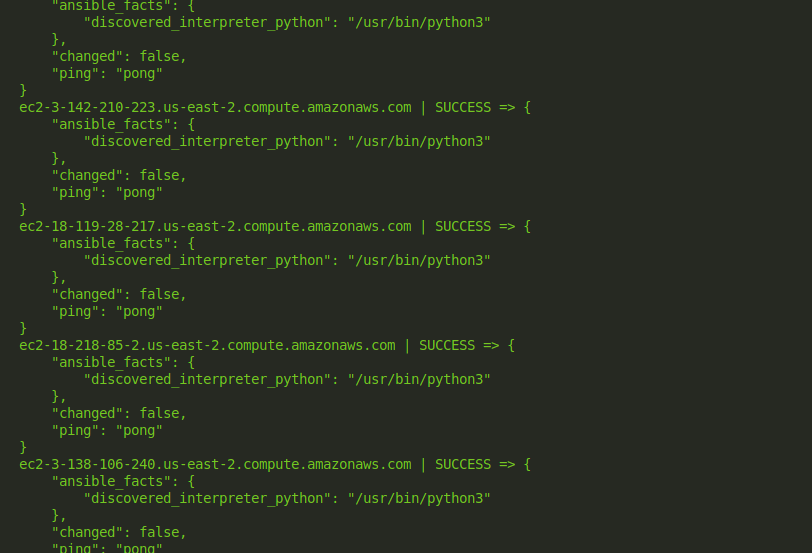
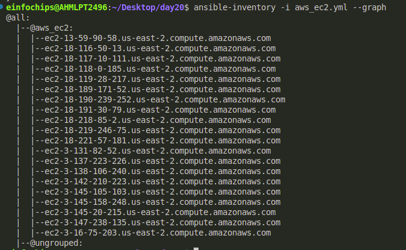
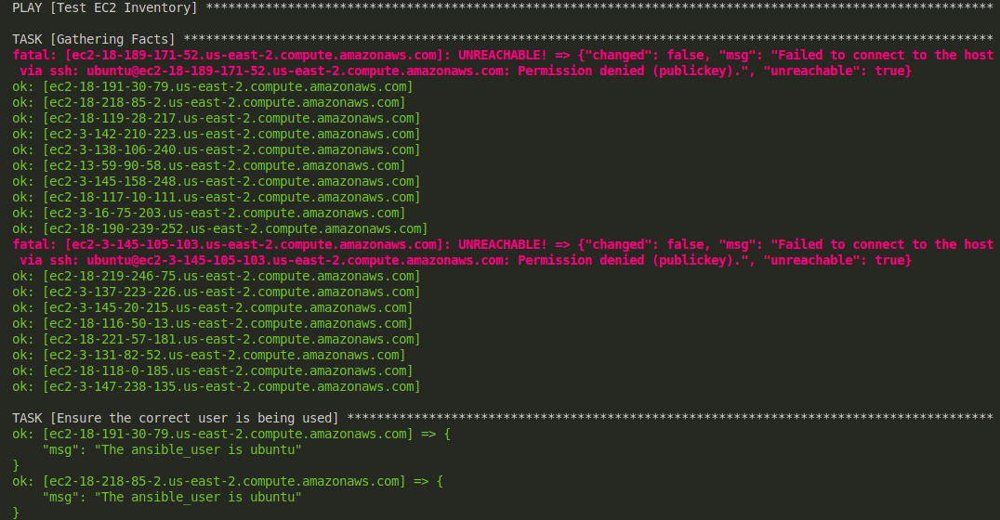
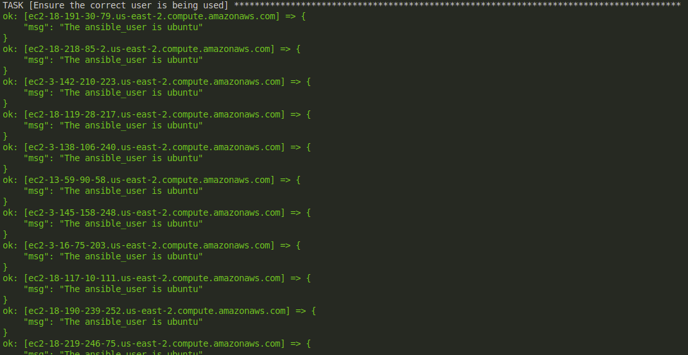
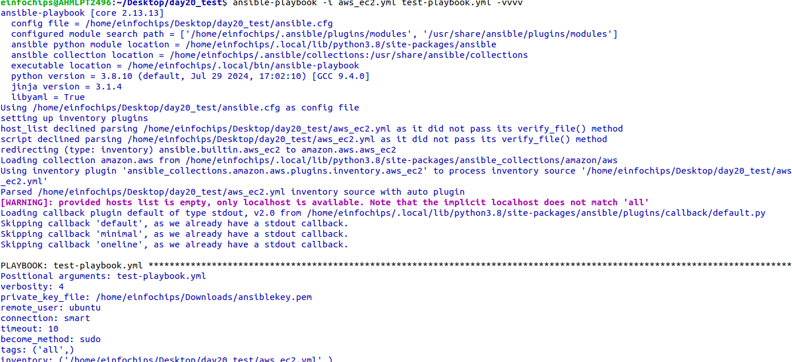
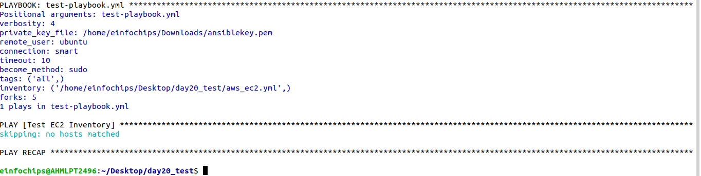
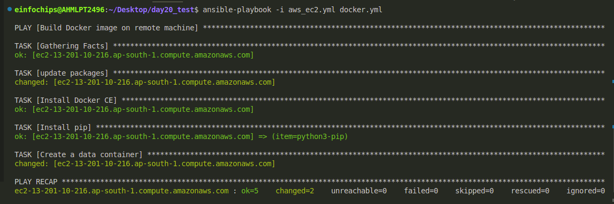

Project 1:

**1. Inventory Plugins

* Activity: Configure a dynamic inventory plugin to manage a growing number of web servers dynamically. Integrate the plugin with Ansible to automatically detect and configure servers in various environments.
* Deliverable: Dynamic inventory configuration file or script, demonstrating the ability to automatically update the inventory based on real-time server data.

**

Step 1: Create the Dynamic Inventory.

```

#!/usr/bin/env python3

import json
import boto3

def get_inventory():
    ec2 = boto3.client('ec2', region_name='us-east-2') 
    response = ec2.describe_instances(Filters=[{'Name': 'tag:Name', 'Values': ['*']}])
  
    inventory = {
        'all': {
            'hosts': [],
            'vars': {}
        },
        '_meta': {
            'hostvars': {}
        }
    }
  
    ssh_key_file = '/home/einfochips/Downloads/ansible-worker.pem' 
    ssh_user = 'ubuntu'  
  
    for reservation in response['Reservations']:
        for instance in reservation['Instances']:
            public_dns = instance.get('PublicDnsName', instance['InstanceId'])
            inventory['all']['hosts'].append(public_dns)
            inventory['_meta']['hostvars'][public_dns] = {
                'ansible_host': instance.get('PublicIpAddress', instance['InstanceId']),
                'ansible_ssh_private_key_file': ssh_key_file,
                'ansible_user': ssh_user
            }

    return inventory

if __name__ == '__main__':
    print(json.dumps(get_inventory()))

```

To tun the playbook we have to check the ping is working or not:

```
ansible -m ping -i denamic_inventory.py all
```

Now to run then playboook with the help of dynamic inventory then:

```
ansible-playbook -i dynamic_inventory.py test-playbook.yml
```



Step 2:

Create an yml inventory file.

```
plugin: aws_ec2
regions:
  - us-east-2
filters:
  instance-state-name:
    - running
hostnames:
  - dns-name
compose:
  ansible_host: public_dns_name
  

```

Now check weather this inventory is working or not:

By following command:

```
ansible-inventory -i aws+ec2.yml --graph
```



**1. Performance Tuning

* Activity: Tune Ansible performance by adjusting settings such as parallel execution (forks), optimizing playbook tasks, and reducing playbook run time.

Deliverable: Optimized ansible.cfg configuration file, performance benchmarks, and documentation detailing changes made for performance improvement.**

Step 1:

To achive this task we have to create customise ansible.cfg file.

```
[defaults]
inventory = /home/einfochips/Desktop/day20/aws_ec2.yml
host_key_checking = False
enable_plugins = aws_ec2, script
ansible_python_interpreter = /usr/bin/python3
remote_user = ubuntu
private_key_file = /home/einfochips/Downloads/ansible-worker.pem
forks = 10

```

Here we added forks=10, which means controls the number of parallel processes for task execution.

Step 2: Now run the test-playbook.yml file with the help of aws_ec2.yml file:

test-playbook.yml:

```
---
- name: Test EC2 Inventory
  hosts: all
  remote_user: ubuntu
  tasks:
    - name: Ensure the correct user is being used
      debug:
        msg: "The ansible_user is {{ ansible_user }}"


```





**3. Debugging and Troubleshooting Playbooks

* Activity: Implement debugging strategies to identify and resolve issues in playbooks, including setting up verbose output and advanced error handling.
* Deliverable: Debugged playbooks with enhanced error handling and logging, including a troubleshooting guide with common issues and solutions.

**

Now to achive this task:

```
ansible-playbook -i aws_ec2.yml test-playbook.yml -vvvv 
```

It give the details about debugging and understanding what Ansible is doing under the hood.





**4. Exploring Advanced Modules

* Activity: Use advanced Ansible modules such as docker\_container to manage containerized applications and aws\_ec2 for AWS infrastructure management, demonstrating their integration and usage.
* Deliverable: Playbooks showcasing the deployment and management of Docker containers and AWS EC2 instances, along with documentation on the benefits and configurations of these advanced modules.

**

Now to achive this task use advanced Ansible modules such as docker\_container to manage containerized applications and aws\_ec2 for AWS infrastructure management, demonstrating their integration and usage.

for this the playbook is deploy.yml

```
---
- name: Build Docker image on remote machine
  hosts: all
  remote_user: ubuntu
  become: true
  tasks: 
    - name: update packages
      apt:
        update_cache: yes

    - name: Install Docker CE
      apt:
        name: docker.*
        state: present

    
    - name: Install pip
      apt:
        name: "{{ item }}"
      loop:
        - python3-pip
  
    # - name: collection in localhost
    #   command:
    #     ansible-galaxy collection install community.docker --upgrade

  
    - name: Create a data container
      community.docker.docker_container:
        name: mydata
        image: busybox
  


```

the output of this playbook is:



check weather the image is present or not in instance: docker images

for conatiner: docker ps
