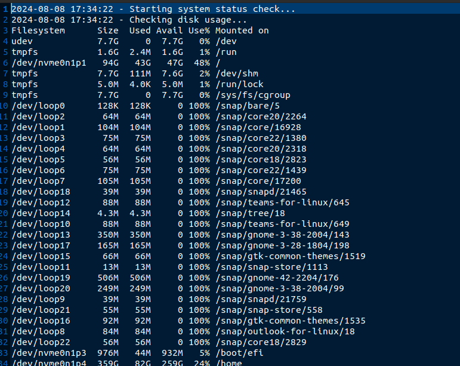
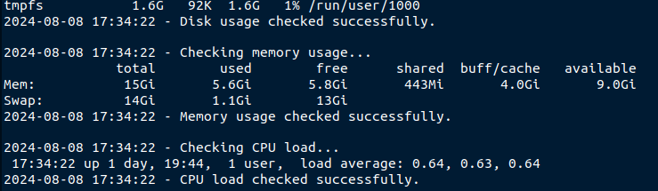
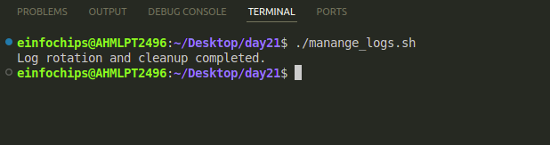
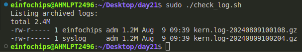
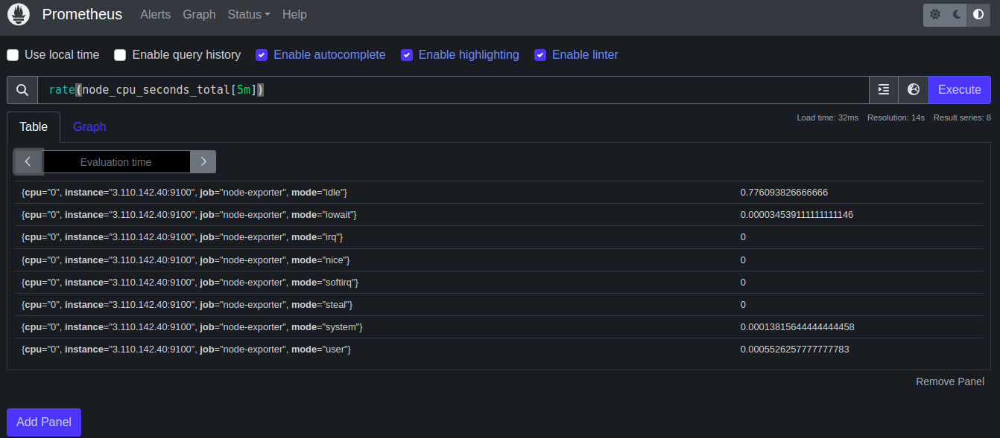
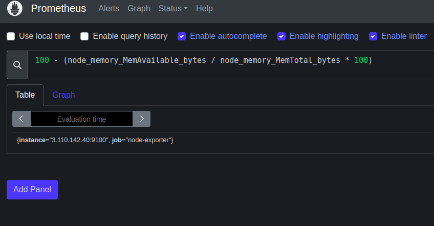
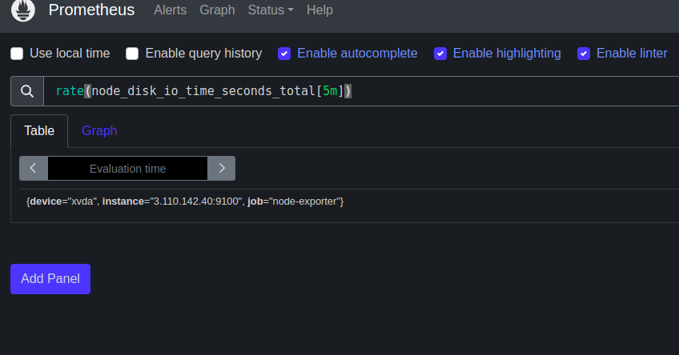
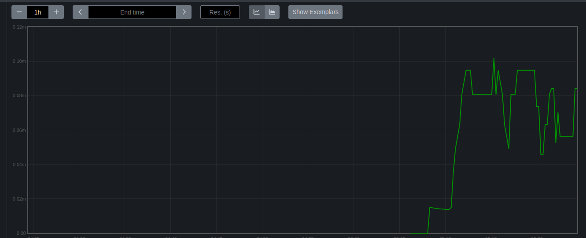

**1. Shell Scripts for Basic Operations:

* Task: Write shell scripts to perform basic system operations, such as checking disk usage, memory usage, and CPU load.
* Deliverable:
  * A collection of scripts that output system performance metrics.
  * Scripts should include error handling and logging.

**

```
#!/bin/bash
LOGFILE="/home/einfochips/Documents/system_check.log"
DATE=$(date "+%Y-%m-%d %H:%M:%S")

echo "$DATE - Starting system status check..." >> $LOGFILE

# Disk Usage
echo "$DATE - Checking disk usage..." >> $LOGFILE
if df -h >> $LOGFILE 2>&1; then
    echo "$DATE - Disk usage checked successfully." >> $LOGFILE
else
    echo "$DATE - Error checking disk usage." >> $LOGFILE
fi
echo "" >> $LOGFILE

# Memory Usage
echo "$DATE - Checking memory usage..." >> $LOGFILE
if free -h >> $LOGFILE 2>&1; then
    echo "$DATE - Memory usage checked successfully." >> $LOGFILE
else
    echo "$DATE - Error checking memory usage." >> $LOGFILE
fi
echo "" >> $LOGFILE

# CPU Load
echo "$DATE - Checking CPU load..." >> $LOGFILE
if uptime >> $LOGFILE 2>&1; then
    echo "$DATE - CPU load checked successfully." >> $LOGFILE
else
    echo "$DATE - Error checking CPU load." >> $LOGFILE
fi
echo "" >> $LOGFILE

```

Now the logsfile is generated in th apath that I have mentioned:





**2. Log Management Script:

* Task: Develop a script to automate log management tasks such as log rotation and archiving. This script should include the ability to compress old logs and delete logs older than a specified number of days.
* Deliverable:
  * A shell script that performs log rotation based on predefined conditions (e.g., log size, log age).
  * A report generated by the script detailing which logs were rotated, compressed, or deleted.

**

```
#!/bin/bash

# Define variables
LOG_DIR="/var/log/myapp"
ARCHIVE_DIR="/home/einfochips/Documents"
MAX_SIZE=10000000  # 10MB
DAYS_TO_KEEP=30

# Create archive directory if it does not exist
if [ ! -d "$ARCHIVE_DIR" ]; then
    mkdir -p "$ARCHIVE_DIR"
    if [ $? -ne 0 ]; then
        echo "Error: Unable to create archive directory $ARCHIVE_DIR" >&2
        exit 1
    fi
fi

# Rotate logs
for log_file in $LOG_DIR/*.log; do
    if [ -f "$log_file" ]; then
        SIZE=$(stat -c%s "$log_file")
        if [ $SIZE -gt $MAX_SIZE ]; then
            ARCHIVE_FILE="$ARCHIVE_DIR/$(basename $log_file).$(date +%F-%H-%M-%S).gz"
            mv "$log_file" "$ARCHIVE_FILE"
            if [ $? -ne 0 ]; then
                echo "Error: Unable to move $log_file to $ARCHIVE_FILE" >&2
                continue
            fi
            gzip "$ARCHIVE_FILE"
            if [ $? -ne 0 ]; then
                echo "Error: Unable to compress $ARCHIVE_FILE" >&2
                continue
            fi
            echo "Archived and compressed $log_file to $ARCHIVE_FILE.gz"
        fi
    fi
done

# Delete old logs
find "$ARCHIVE_DIR" -type f -mtime +$DAYS_TO_KEEP -exec rm {} \;
if [ $? -ne 0 ]; then
    echo "Error: Unable to delete old logs from $ARCHIVE_DIR" >&2
    exit 1
fi

echo "Log rotation and cleanup completed."  
```



**3. Advanced Shell Scripting - Loops, Conditions, Functions, and Error Handling:

* Task: Refactor the previous scripts to include loops, conditionals, and functions for modularity. Implement error handling to manage potential issues during script execution.
* Deliverable:
  * Modular shell scripts that use functions for repeatable tasks.
  * Error-handling mechanisms in place for scenarios like missing files, insufficient permissions, etc.
  * Logs that track script execution and any errors encountered.

**

```
#!/bin/bash
LOG_DIR="/var/log"
ARCHIVE_DIR="/home/einfochips/Documents/logs"
MAX_LOG_AGE=30 
LOG_SIZE_LIMIT=10000000 
ERROR_LOG="/var/log/log_management_error.log"
INFO_LOG="/var/log/log_management.log"
mkdir -p "$ARCHIVE_DIR"
rotate_logs() {
    echo "Starting log rotation..." >> "$INFO_LOG"
    for log_file in "$LOG_DIR"/*.log; do
        if [ -f "$log_file" ]; then
            if [ $(stat -c%s "$log_file") -gt $LOG_SIZE_LIMIT ]; then
                timestamp=$(date +'%Y%m%d%H%M%S')
                mv "$log_file" "$ARCHIVE_DIR/$(basename "$log_file")-$timestamp"
                gzip "$ARCHIVE_DIR/$(basename "$log_file")-$timestamp"
                echo "Log file $(basename "$log_file") rotated and compressed." >> "$INFO_LOG"
            fi
        fi
    done
}
delete_old_logs() {
    echo "Starting deletion of old logs..." >> "$INFO_LOG"
    find "$ARCHIVE_DIR" -type f -mtime +$MAX_LOG_AGE -exec rm {} \;
    echo "Old logs deleted." >> "$INFO_LOG"
}
show_archived_logs() {
    echo "Listing archived logs:"
    ls -lh "$ARCHIVE_DIR"
}
check_directories() {
    if [ ! -d "$LOG_DIR" ]; then
        echo "Error: Log directory $LOG_DIR does not exist." >&2
        exit 1
    fi

    if [ ! -d "$ARCHIVE_DIR" ]; then
        echo "Error: Archive directory $ARCHIVE_DIR does not exist." >&2
        exit 1
    fi
}
{
    check_directories
    rotate_logs
    delete_old_logs
    show_archived_logs
} || {
    echo "An error occurred during log management." >> "$ERROR_LOG"
    exit 1
}
```



**4. Log Checking and Troubleshooting:

* Task: Write a script that reads through system and application logs, identifies common issues (e.g., out of memory, failed service starts), and provides troubleshooting steps based on log analysis.
* Deliverable:
  * A script that parses logs for errors or warnings and outputs possible root causes.
  * Documentation on the types of logs checked and the issues identified.
  * A troubleshooting guide based on common errors found in the logs.

**

```
#!/bin/bash
LOGFILE="/var/log/syslog"
ERROR_LOG="/var/log/error_analysis.log"

grep -i "error" $LOGFILE | while read -r line; do
    echo "Found Error: $line" >> $ERROR_LOG
    # Simple pattern matching for troubleshooting
    if echo "$line" | grep -q "out of memory"; then
        echo "Troubleshooting: Check memory usage and consider increasing swap space." >> $ERROR_LOG
    fi
done
```

**5. Installation and Setup of Prometheus and Node Exporter:

* Task: Install and configure Prometheus and Node Exporter on the system. Ensure that Node Exporter is properly configured to collect system metrics.
* Deliverable:
  * A documented installation and configuration process for Prometheus and Node Exporter.
  * A running instance of Prometheus scraping metrics from Node Exporter.

**

Install Prometheus and Node exportter in VM

```
wget https://github.com/prometheus/prometheus/releases/download/v2.53.1/prometheus-2.53.1.linux-amd64.tar.gz
```

Install Node exporter in different machine

```
wget https://github.com/prometheus/node_exporter/releases/download/v1.8.2/node_exporter-1.8.2.linux-amd64.tar.gz
```


**6. Prometheus Query Language (PromQL) Basic Queries:

* Task: Create a series of PromQL queries to monitor system performance, such as CPU usage, memory usage, and disk I/O.
* Deliverable:
  * A set of PromQL queries that can be used to monitor key system metrics.
  * A dashboard setup guide or configuration that visualizes these metrics in Prometheus or Grafana.

**


Here is the cpu usage in every 5m




Calculating Memory Usage Percentage: 100 - (node\_memory\_MemAvailable\_bytes / node\_memory\_MemTotal\_bytes \* 100)


\


Disk I/O: rate(node_disk_io_time_seconds_total[5m])




