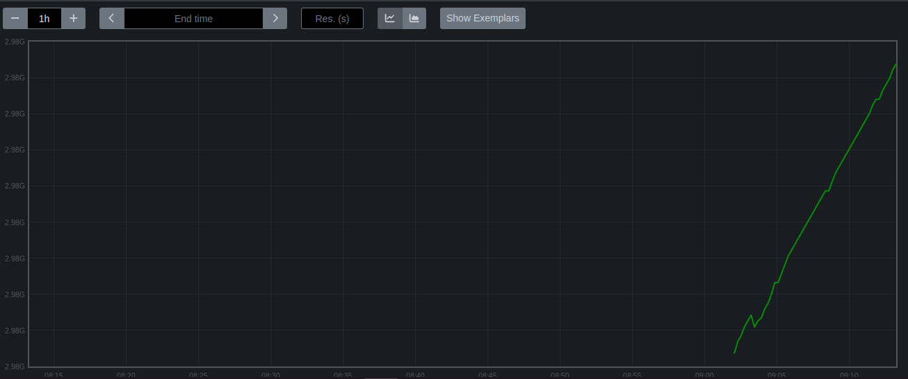

#### Configuring Jobs and Targets

* Task: Set up a Prometheus server to monitor multiple services running on different nodes.
* Deliverables:
  * Configure Prometheus with jobs for monitoring different services like web servers, databases, and system metrics.
  * Define static and dynamic targets using file-based and service discovery methods (e.g., Consul or Kubernetes).


After higging the https://localhost:9090


#### Using Exporters (Node Exporter)

* Task: Use Node Exporter to monitor system-level metrics like CPU, memory, disk usage, and network statistics.
* Deliverables:
  * Install and configure Node Exporter on all nodes.
  * Ensure Node Exporter metrics are being correctly scraped by Prometheus.


#### Hands-on Exercise: Setting Up Exporters

* Task: Configure at least two different types of exporters (e.g., Node Exporter and MySQL Exporter) and integrate them with Prometheus.
* Deliverables:
  * Demonstrate successful data collection from both exporters.
  * Create a basic Prometheus dashboard to visualize key metrics from these exporters.

```
wget https://github.com/prometheus/mysqld_exporter/releases/download/v0.15.1/mysqld_exporter-0.15.1.linux-amd64.tar.gz
```

```
tar xvfz mysqld_exporter-0.15.1.linux-amd64.tar.gz
```

Now install mysql server

```
sudo apt install mysql-server
```

```
sudo mysql -u root -p
```

```
CREATE DATABASE example_db;CREATE USER 'example_user'@'localhost' IDENTIFIED BY 'strong_password';GRANT ALL PRIVILEGES ON example_db.* TO 'example_user'@'localhost';
FLUSH PRIVILEGES;
```

**Edit the MySQL configuration file (**`/etc/mysql/mysql.conf.d/mysqld.cnf`)

```
[mysqld]bind-address = 0.0.0.0
```

```
sudo systemctl restart mysql
```

** Create a MySQL User for Exporter*** Replace `'exporter_password'` with a secure password.

```
CREATE USER 'mysqld_exporter'@'localhost' IDENTIFIED BY 'exporter_password';GRANT PROCESS, REPLICATION CLIENT, SELECT ON *.* TO 'mysqld_exporter'@'localhost';
FLUSH PRIVILEGES;
```

Now Start MySQL Exporter:

```
./mysqld_exporter --config.my-cnf /etc/mysql/mysql.conf.d/mysqld.cnf &
```

Now run the p[ropmotheus script file once again:

you will get the output like this:


#### Introduction to PromQL

* Task: Learn and implement basic PromQL queries to extract meaningful data from the metrics collected.
* Deliverables:
  * Write basic queries to retrieve metrics like average CPU usage, memory consumption, and disk I/O over time.

CPU Usage:

```
avg(rate(node_cpu_seconds_total{mode="user"}[5m]))
```


Memory Consumption:

```
node_memory_MemTotal_bytes - node_memory_MemFree_bytes
```


**disk I/O over tim**e

```
avg(rate(node_disk_written_bytes_total[5m])) by (instance)
```


####  Basic Queries (Selectors, Functions, Operators)

* Task: Create PromQL queries using selectors, functions, and operators to filter and manipulate time-series data.
* Deliverables:
  * Write PromQL queries to calculate the 95th percentile of CPU usage.
  * Use functions like rate(), increase(), and histogram\_quantile() to perform more complex analysis.

#### 6. Advanced Queries and Aggregations

* Task: Perform advanced data aggregation using PromQL.
* Deliverables:

  * Write queries to calculate the total memory usage across all nodes.
  * Aggregate data to find the maximum disk space usage among all nodes

    **Graph of total memory usage across all nodes**

    ```
    sum(node_memory_MemTotal_bytes - node_memory_MemFree_bytes)
    ```

    

  **Graph of maximum disk space usage among all nodes**

  ```
  max(node_filesystem_size_bytes - node_filesystem_free_bytes)
  ```

  

#### 7. Configuring Alertmanager

* Task: Set up Alertmanager to handle alerts generated by Prometheus.
* Deliverables:
  * Configure Alertmanager with Prometheus.
  * Create routing rules to manage alert notifications based on severity and service type.

#### 8. Writing Alerting Rules

* Task: Write custom alerting rules in Prometheus to trigger alerts based on specific conditions.
* Deliverables:
  * Create alerting rules for high CPU usage, memory leaks, and disk space running low.
  * Ensure alerts are correctly generated and sent to Alertmanager.

#### 9. Setting Up Notification Channels (Email, Slack, etc.)

* Task: Integrate Alertmanager with multiple notification channels like Email and Slack.
* Deliverables:
  * Set up Email notifications for critical alerts.
  * Integrate Slack for real-time alerts and notifications.

#### 10. Hands-on Exercise: Creating Alerts

* Task: Test the entire alerting pipeline by creating and triggering custom alerts.
* Deliverables:
  * Simulate a scenario where a node exceeds 90% CPU usage and ensure alerts are triggered and sent to both Email and Slack.
  * Validate the alerts in both notification channels.

**
