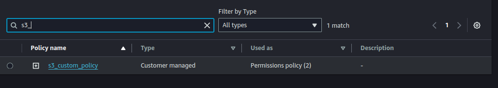
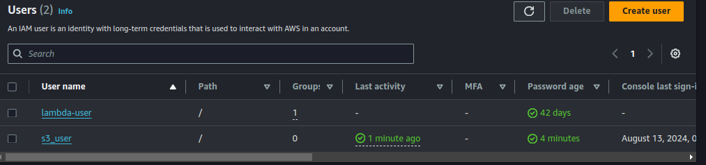
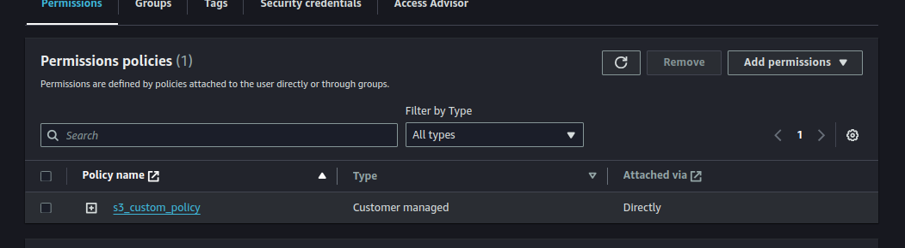
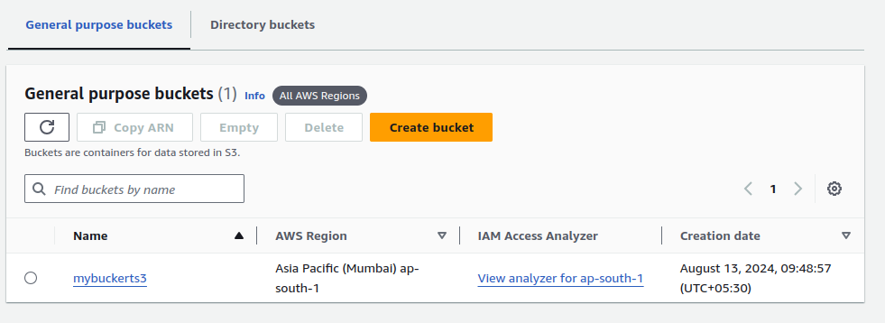
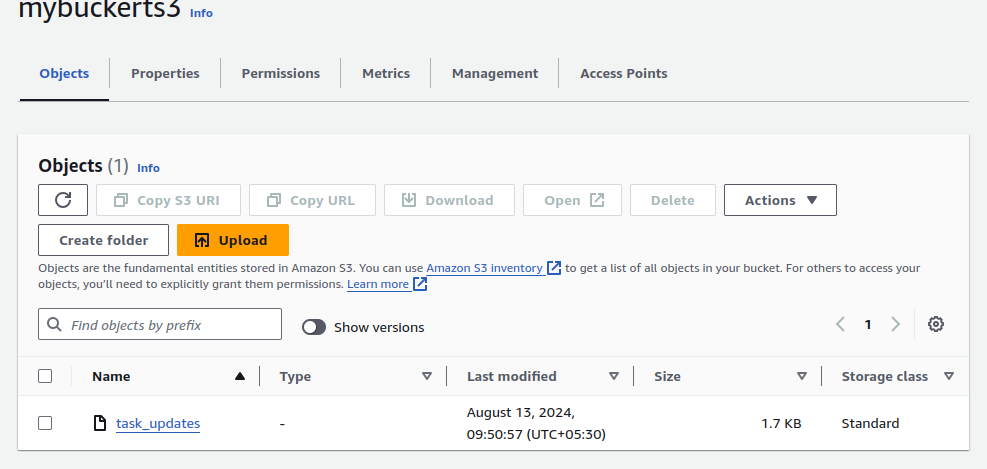

#### Part 1: Implementing a Custom IAM Policy for S3 Access

Scenario:
You have a scenario where a development team needs access to an S3 bucket containing logs generated by an application. Only a specific IAM role, "DevTeamRole," should have permission to list and read objects in this bucket, while no other actions should be allowed. The participants will implement this policy to meet this requirement.

#### Steps:

1. Understand the Requirements:
   * Review the scenario where only the "DevTeamRole" is allowed to access the S3 bucket named application-logs.
   * The policy should only permit s3:ListBucket and s3:GetObject actions on this bucket.
2. Create a New IAM Policy:

* Navigate to the IAM console and create a new custom policy.
* Define the policy to allow s3:ListBucket and s3:GetObject actions.
* Specify the ARN of the application-logs bucket and any specific objects within the bucket as resources.

1. Attach the Policy to the IAM Role:

* Attach the custom policy to the "DevTeamRole" role.
* Ensure that no other users or roles are granted access to this bucket by this policy.

1. Test the Policy:

* Attempt to access the S3 bucket using the "DevTeamRole" to ensure only the allowed actions (list and read) are permitted.
* Document the results of the test, ensuring that actions outside of the allowed scope (e.g., delete, write) are correctly denied.

**
To achive the following task:

Step 1:

Create the custom policy as per the question:

permit s3:ListBucket and s3:GetObject.

Step 2:

Create the role named as DevTeamRole is allowed to access the S3 bucket.

Step 3:

Create an  IAM user and attach this policy ot that user:

Step 4:

Login with IAM user.

Step 5:

Now go to s3 bucket section and click it:

s3:listbucket

s3: getObject:

