# Deploying a Path-Based Routing Web Application on AWS

## Objective:

To evaluate your skills in deploying a web application on AWS using EC2 instances, configuring security groups, and setting up an Application Load Balancer (ALB) with path-based routing. You will deploy two simple web applications, configure the ALB to route traffic based on the URL path, and terminate all resources once the project is complete.

## Project Scenario:

A small company needs to deploy two lightweight web applications, "App1" and "App2," on AWS. The traffic to these applications should be routed through a single Application Load Balancer (ALB) based on the URL path. The company has opted for t2.micro instances for cost efficiency.

## Project Steps and Deliverables:

### 1. EC2 Instance Setup (30 minutes):

Launch EC2 Instances:

Launch four EC2 t2.micro instances using the Amazon Linux 2 AMI.

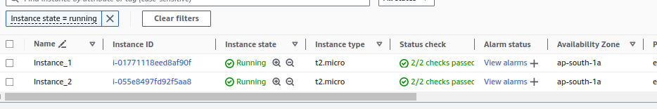

SSH into each instance and deploy a simple web application:

Deploy "App1" on one instances.

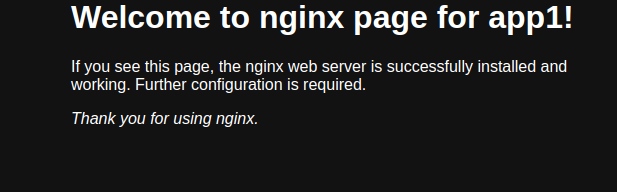

Deploy "App2" on another instances.

### 2. Security Group Configuration (20 minutes):

Create Security Groups:

Create a security group for the EC2 instances that allows inbound HTTP (port 80) and SSH (port 22) traffic from your IP address.

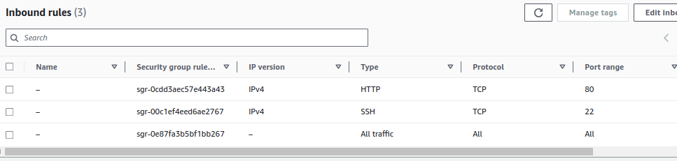

### 3. Application Load Balancer Setup with Path-Based Routing (40 minutes):

Create an Application Load Balancer (ALB):

Set up an ALB in the same VPC and subnets as your EC2 instances.

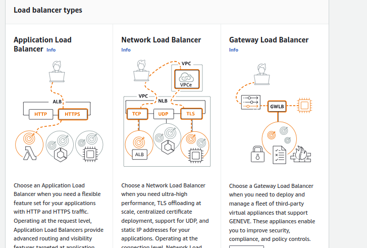

Now Choose ALB -> Internet facing -> Network mapping

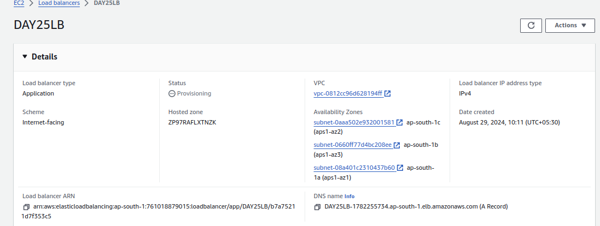

Configure the ALB with two target groups:

Target Group 1: For "App1" instances.

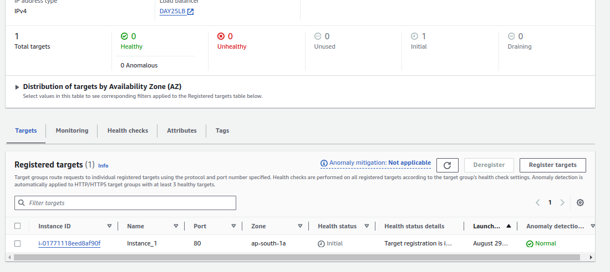

Target Group 2: For "App2" instances.

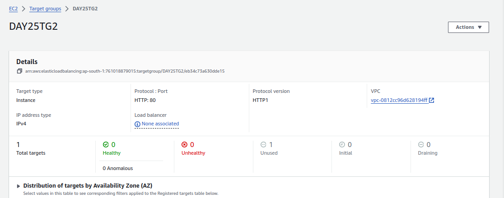

Register the appropriate EC2 instances with each target group.

here it is showing for instance 1 ia attched to tagget group 1

Now for the instance 2 is attached to target group 2:
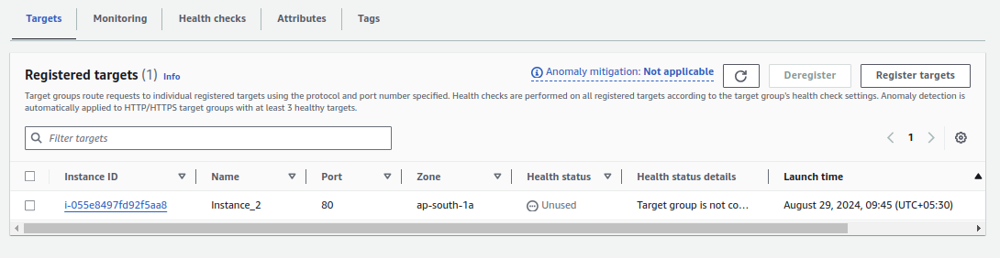

Configure Path-Based Routing:

Set up path-based routing rules on the ALB:

Route traffic to "App1" instances when the URL path is /app1.

Route traffic to "App2" instances when the URL path is /app2.

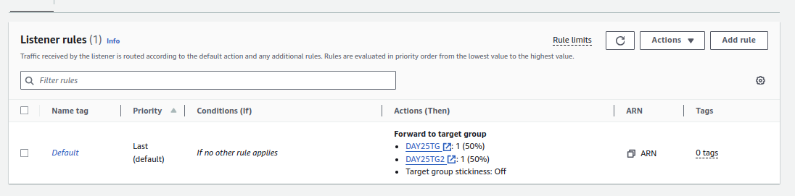

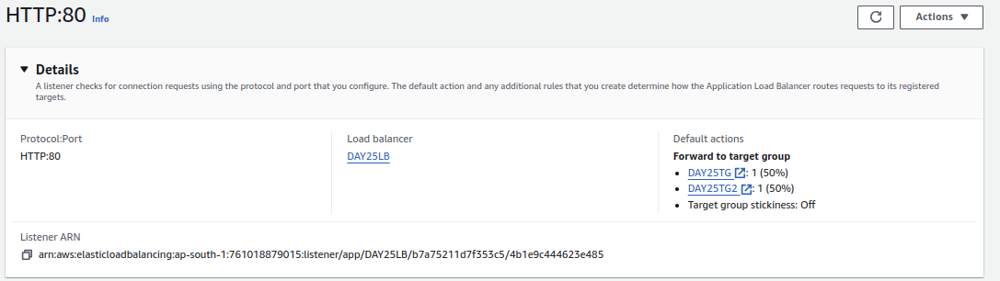

### 4. Testing and Validation (20 minutes):

Test Path-Based Routing:

Access the ALB's DNS name and validate that requests to /app1 are correctly routed to the "App1" instances and that /app2 requests are routed to the "App2" instances.

Now copy and paste the loadbalancer dns address:

### 5. Resource Termination (10 minutes):

Terminate EC2 Instances:

Stop and terminate all EC2 instances.

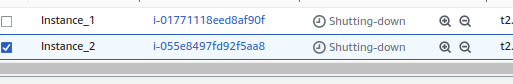

Delete the ALB and the associated target groups.

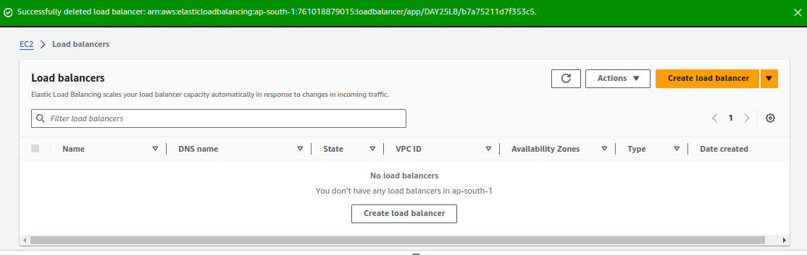

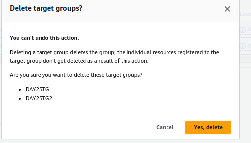

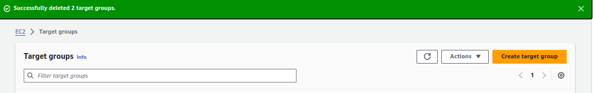

