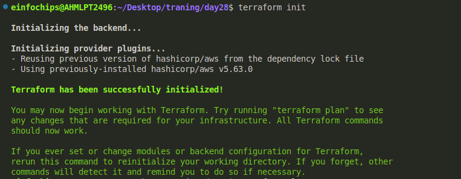
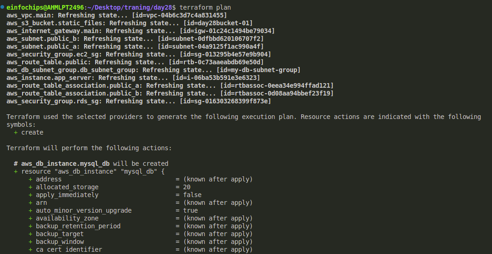
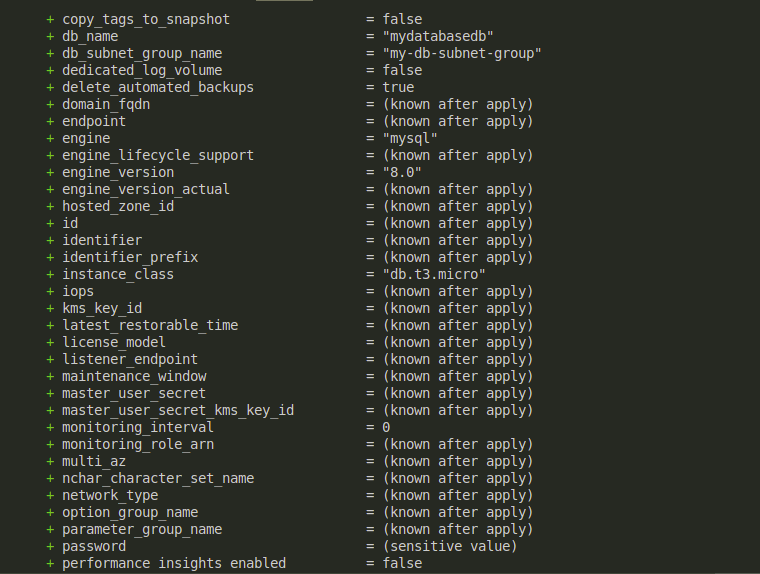
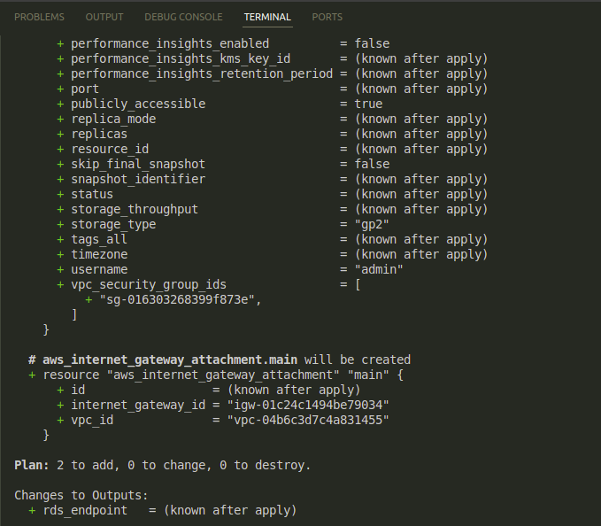
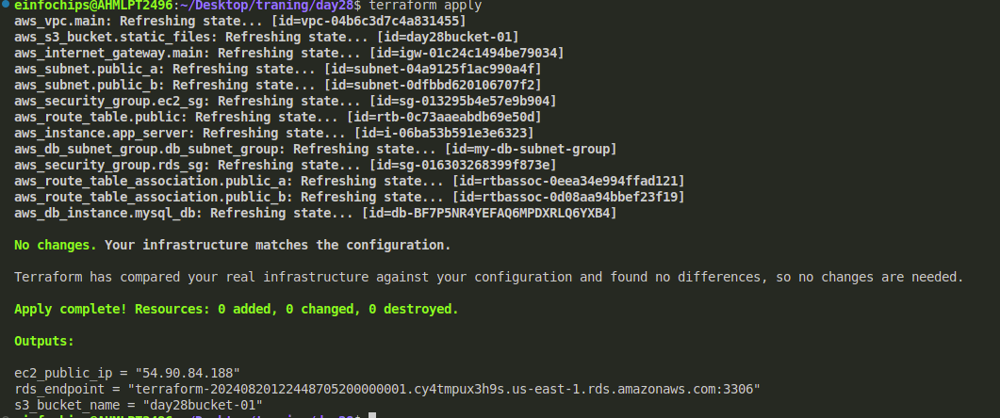

#### This project will assess your ability to deploy a multi-tier architecture application on AWS using Terraform. The deployment will involve using Terraform variables, outputs, and change sets. The multi-tier architecture will include an EC2 instance, an RDS MySQL DB instance, and an S3 bucket.

#### Project Overview:

You are required to write Terraform configuration files to automate the deployment of a multi-tier application on AWS. The architecture should consist of:

1. EC2 Instance: A t2.micro instance serving as the application server.
2. RDS MySQL DB Instance: A t3.micro instance for the database backend.
3. S3 Bucket: For storing static assets or configuration files.

#### Specifications:

* EC2 Instance: Use the t2.micro instance type with a public IP, allowing HTTP and SSH access.
* RDS MySQL DB Instance: Use the t3.micro instance type with a publicly accessible endpoint.
* S3 Bucket: Use for storing static assets, configuration files, or backups.
* Terraform Configuration:
  * Utilize Terraform variables to parameterize the deployment (e.g., instance type, database name).
  * Use Terraform outputs to display important information (e.g., EC2 public IP, RDS endpoint).
  * Implement change sets to demonstrate how Terraform manages infrastructure changes.
* No Terraform Modules: Focus solely on the core Terraform configurations without custom or external modules.

#### Key Tasks:

1. Setup Terraform Configuration:
   * Provider Configuration:

     * Configure the AWS provider to specify the region for deployment.
     * Ensure the region is parameterized using a Terraform variable.
   * VPC and Security Groups:
   * Create a VPC with a public subnet for the EC2 instance.
   * Define security groups allowing HTTP and SSH access to the EC2 instance, and MySQL access to the RDS instance.
   * EC2 Instance:
   * Define the EC2 instance using a t2.micro instance type.
   * Configure the instance to allow SSH and HTTP access.
   * Use Terraform variables to define instance parameters like AMI ID and instance type.
   * RDS MySQL DB Instance:
   * Create a t3.micro MySQL DB instance within the same VPC.
   * Use Terraform variables to define DB parameters like DB name, username, and password.
   * Ensure the DB instance is publicly accessible, and configure security groups to allow access from the EC2 instance.
   * S3 Bucket:
   * Create an S3 bucket for storing static files or configurations.
   * Allow the EC2 instance to access the S3 bucket by assigning the appropriate IAM role and policy.
   * Outputs:
   * Define Terraform outputs to display the EC2 instance’s public IP address, the RDS instance’s endpoint, and the S3 bucket name.
2. Apply and Manage Infrastructure:

* Initial Deployment:
* Run terraform init to initialize the configuration.
* Use terraform plan to review the infrastructure changes before applying.
* Deploy the infrastructure using terraform apply, and ensure that the application server, database, and S3 bucket are set up correctly.
* Change Sets:
* Make a minor change in the Terraform configuration, such as modifying an EC2 instance tag or changing an S3 bucket policy.
* Use terraform plan to generate a change set, showing what will be modified.
* Apply the change set using terraform apply and observe how Terraform updates the infrastructure without disrupting existing resources.

1. Testing and Validation:

* Validate the setup by:
* Accessing the EC2 instance via SSH and HTTP.
* Connecting to the MySQL DB instance from the EC2 instance.
* Verifying that the EC2 instance can read and write to the S3 bucket.
* Check the Terraform outputs to ensure they correctly display the relevant information.

1. Resource Termination:

* Once the deployment is complete and validated, run terraform destroy to tear down all the resources created by Terraform.
* Confirm that all AWS resources (EC2 instance, RDS DB, S3 bucket, VPC) are properly deleted.

1. Documentation:

* Document the entire process, including Terraform configurations, the purpose of each Terraform file, variables used, and outputs.
* Include screenshots or logs demonstrating the deployment, testing, and destruction of the resources.

#### Deliverables:

* Terraform Configuration Files: All .tf files used in the deployment.
* Deployment Documentation: Detailed documentation covering the setup, deployment, change management, and teardown processes.
* Test Results: Evidence of successful deployment and testing, including screenshots or command outputs.
* Cleanup Confirmation: Confirmation that all resources have been terminated using terraform destroy.

Here to achive the task we will follow these steps:

Step 1:

Configure aws using aws cli command.

```
aws configure
```

Step 2:

Now create the multi-tier architecture will include an EC2 instance, an RDS MySQL DB instance, and an S3 bucket with the help of terraform.

Step 3:

Now made main.tf file

```
resource "aws_vpc" "main" {
  cidr_block = "10.0.0.0/16"
  enable_dns_support = true
  enable_dns_hostnames = true
}
resource "aws_subnet" "public_a" {
  vpc_id                  = aws_vpc.main.id
  cidr_block              = "10.0.1.0/24"
  availability_zone       = "us-east-1a"
  map_public_ip_on_launch = true
}
resource "aws_subnet" "public_b" {
  vpc_id                  = aws_vpc.main.id
  cidr_block              = "10.0.2.0/24"
  availability_zone       = "us-east-1b"
  map_public_ip_on_launch = true
}
resource "aws_internet_gateway" "main" {
  vpc_id = aws_vpc.main.id
}

# resource "aws_internet_gateway_attachment" "main" {
#   internet_gateway_id = aws_internet_gateway.main.id
#   vpc_id              = aws_vpc.main.id
# }
resource "aws_route_table" "public" {
  vpc_id = aws_vpc.main.id

  route {
    cidr_block = "0.0.0.0/0"
    gateway_id = aws_internet_gateway.main.id
  }
}

resource "aws_route_table_association" "public_a" {
  subnet_id      = aws_subnet.public_a.id
  route_table_id = aws_route_table.public.id
}

resource "aws_route_table_association" "public_b" {
  subnet_id      = aws_subnet.public_b.id
  route_table_id = aws_route_table.public.id
}
resource "aws_security_group" "ec2_sg" {
  vpc_id = aws_vpc.main.id

  egress {
    from_port   = 0
    to_port     = 0
    protocol    = "tcp"
    cidr_blocks = ["0.0.0.0/0"]
  }

  ingress {
    from_port   = 22
    to_port     = 22
    protocol    = "tcp"
    cidr_blocks = ["0.0.0.0/0"]
  }

  ingress {
    from_port   = 80
    to_port     = 80
    protocol    = "tcp"
    cidr_blocks = ["0.0.0.0/0"]
  }
}

resource "aws_security_group" "rds_sg" {
  vpc_id = aws_vpc.main.id

  egress {
    from_port   = 0
    to_port     = 0
    protocol    = "tcp"
    cidr_blocks = ["0.0.0.0/0"]
  }

  ingress {
    from_port   = 3306
    to_port     = 3306
    protocol    = "tcp"
    security_groups = [aws_security_group.ec2_sg.id]
  }
}
resource "aws_instance" "app_server" {
  ami           = var.ami_id
  instance_type = var.instance_type
  subnet_id     = aws_subnet.public_a.id
  # security_groups = [aws_security_group.ec2_sg.name]

  tags = {
    Name = "AppServer"
  }
}
resource "aws_db_instance" "mysql_db" {
  allocated_storage    = 20
  storage_type         = "gp2"
  engine               = "mysql"
  engine_version       = "8.0"
  instance_class       = "db.t3.micro"
  db_name              = "mydatabasedb"
  username             = var.db_username
  password             = var.db_password
  publicly_accessible  = true
  db_subnet_group_name = aws_db_subnet_group.db_subnet_group.name
  vpc_security_group_ids = [aws_security_group.rds_sg.id]
}
resource "aws_s3_bucket" "static_files" {
  bucket = var.bucket_name
}
resource "aws_db_subnet_group" "db_subnet_group" {
  name        = "my-db-subnet-group"
  subnet_ids  = [aws_subnet.public_a.id, aws_subnet.public_b.id]
  tags = {
    Name = "My DB Subnet Group"
  }
}

```

Now Initialize directory by terraform init command and setting it up by downloading the nesessary provider plugins. 

```
terraform init
```



Now validate the configuration file and checks for the syntax error & internal consistencies.

```
terraform validate
```

Now type terraform plan:

```
terraform plan
```

It generates and displays an execution *plan*, detailing which actions will be taken on which resources, allowing for a review before actual application.







Now apply the changes:

```
terraform appply
```

Apply command in Terraform executes actions proposed in a `terraform plan` to deploy infrastructure.


