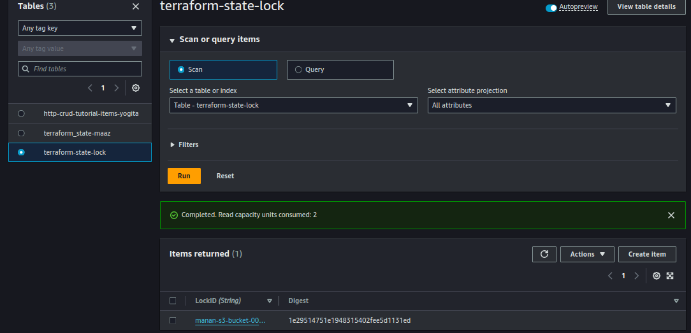

#### Project: Advanced Terraform with Modules, Functions, State Locks, Remote State Management, and Variable Configuration

#### Project Objective:

This project will test your skills in using Terraform modules, functions, variables, state locks, and remote state management. The project requires deploying infrastructure on AWS using a custom Terraform module and managing the state remotely in an S3 bucket, while testing the locking mechanism with DynamoDB. Participants will also configure variables and outputs using functions.

#### Project Overview:

You will create a Terraform configuration that uses a custom module to deploy a multi-component infrastructure on AWS. The state files will be stored remotely in an S3 bucket, and DynamoDB will handle state locking. Additionally, the project will involve creating a flexible and reusable Terraform module, using input variables (tfvars) and Terraform functions to parameterize configurations.

#### Specifications:

* Terraform Modules: Create a reusable module that can deploy both an EC2 instance and an S3 bucket.
* Terraform Functions: Use Terraform built-in functions to manipulate and compute variable values (e.g., length, join, lookup).
* State Management: Store the Terraform state in an S3 bucket and configure DynamoDB for state locking to prevent concurrent changes.
* Variable Configuration (tfvars): Parameterize the infrastructure using variables for instance type, region, and other configurable options.
* Outputs: Use outputs to display important information such as EC2 instance details and the S3 bucket name after deployment.

#### Key Tasks:

1. Remote State Management:
   * S3 Bucket for State:
     * Create an S3 bucket using Terraform (this can be separate from the custom module).
     * Configure Terraform to store the state file in the S3 bucket.
   * State Locking with DynamoDB:
   * Create a DynamoDB table using Terraform (or manually if required) to store the state lock information.
   * Configure Terraform to use this DynamoDB table for state locking.
2. Terraform Module Creation:

* Custom Module:
* Create a Terraform module to deploy the following AWS resources:
* EC2 instance: Use an AMI for the region and allow SSH access using a security group.
* S3 bucket: Create an S3 bucket for application data.
* Use Terraform variables (txvars) to parameterize important aspects such as:
* Instance Type: Allow the instance type to be configurable (e.g., t2.micro).
* Region: Parameterize the AWS region so that the module can be reused across regions.
* Bucket Name: Use a variable to set the S3 bucket name.
* Terraform Functions:
* Use Terraform functions in your module to manipulate and process the variables. For example:
* Use join to combine strings for resource names.
* Use lookup to set default values if a variable is not provided.
* Use length to count the number of instances or resources.

1. Input Variables and Configuration (txvars):

* Define input variables to make the infrastructure flexible:
* EC2 instance type.
* S3 bucket name.
* AWS region.
* Any other variable relevant to the infrastructure.
* Use the default argument for variables where appropriate.

1. Output Configuration:

* Set up Terraform outputs to display key information after the infrastructure is created:
* EC2 Public IP: Output the public IP of the EC2 instance.
* S3 Bucket Name: Output the name of the S3 bucket created.
* Region: Output the region where the resources were deployed.

1. Testing State Locking and Remote State:

* State Locking:
* Attempt to run terraform apply from two different terminals simultaneously to test state locking.
* Confirm that DynamoDB properly handles the state lock, preventing concurrent updates.
* Remote State Management:
* Verify that Terraform state is being stored in the S3 bucket and that updates are reflected in the remote state file.

1. Apply and Modify Infrastructure:

* Initial Deployment:
* Use terraform plan and terraform apply to deploy the infrastructure.
* Verify that the EC2 instance, S3 bucket, and all configurations are properly set up.
* Infrastructure Changes:
* Modify one of the variables (e.g., change the instance type or add tags) and re-run terraform apply.
* Observe how Terraform plans and applies only the necessary changes, with state locking in effect.

1. Resource Termination:

* Once the deployment is complete and tested, use terraform destroy to tear down all the resources created by Terraform.
* Ensure that the S3 bucket, EC2 instance, and DynamoDB table (if not reused) are deleted.

1. Documentation:

* Document the Terraform module, including how to use the variables, functions, and state management.
* Include instructions on how to configure and manage the remote state and locking mechanism.
* Provide screenshots or logs showing the deployment process and testing of state locking.

#### Deliverables:

* Terraform Configuration Files: All .tf files including the main configuration and the custom module.
* Documentation: Detailed documentation explaining the use of variables, functions, state management, and how to test the locking mechanism.
* Test Results: Evidence that state locking was successfully tested (e.g., screenshots of simultaneous terraform apply attempts).
* Resource Teardown Confirmation: Confirmation that all AWS resources were properly destroyed using terraform destroy.

#### Estimated Time:

This project is designed to take 2 hours to complete.


Here is the steps top achive the task.

Step 1:
Create the seperate folder in which there is a main>tf file and variable>tf file

In main.tf file you have to make a S3 bucket and Dynamodb table.

```
resource "aws_s3_bucket" "web" {
  bucket = "manan-s3-bucket-001"
}

resource "aws_dynamodb_table" "state_lock" {
  name           = "terraform-state-lock"
  billing_mode    = "PAY_PER_REQUEST"
  hash_key        = "LockID"
  attribute {
    name = "LockID"
    type = "S"
  }
}

```

Now apply terraform init which will initialize the directory and install the necessary plugins.

```
terraform init
```


Now terraform plan which will give an idea about what did you achive after hitting the terraform apply command.


Now we do terraform apply command to reach the desired state of configuration and after apply state file is creatred.


In this part we have created a bucket and in this bucket after hitting terraform apply the data will show here

Step 2:

Now In this part we create another folder in which we create terraform modules.

modules/

.
├── aws_infrastructure
│   ├── main.tf
│   └── variable.tf
├── backend.tf
├── main.tf
└── variable.tf

this is the directory structure.

aws_infrastructure/main.tf:

```

resource "aws_instance" "web" {
  ami           = var.ami_id
  instance_type = var.instance_type
  tags = {
    Name = "WebInstance"
  }

  vpc_security_group_ids = [aws_security_group.sg.id]
}

resource "aws_security_group" "sg" {
  name        = "web-sg"
  description = "Allow SSH access"
  ingress {
    from_port   = 22
    to_port     = 22
    protocol    = "tcp"
    cidr_blocks = ["0.0.0.0/0"]
  }
}

resource "aws_s3_bucket" "app_data" {
  bucket = var.bucket_name
}


output "instance_public_ip" {
  value = aws_instance.web.public_ip
}

output "bucket_name" {
  value = aws_s3_bucket.app_data.bucket
}

output "region" {
  value = var.region
}

```

aws_infrastructure/variable.tf:

```
variable "instance_type" {
  description = "Type of EC2 instance"
  default     = "t2.micro"
}
variable "ami_id" {
  description = "The AMI ID for the EC2 instance"
  default     = "ami-0d53d72369335a9d6"
}
variable "bucket_name" {
  description = "Name of the S3 bucket"
  default = "manan-s3-bucket-2"
}

variable "region" {
  description = "AWS region"
  default     = "us-west-1"
}

```

backend.tf

```
terraform {
  backend "s3" {
    bucket         = "manan-s3-bucket-001" 
    key            = "terraform/state.tfstate"
    region         = "us-west-1" 
    dynamodb_table = "terraform-state-lock"
  }
}

```

main.tf

```
provider "aws" {
  region = var.region
}


module "aws_infrastructure" {
  source         = "./aws_infrastructure"
  instance_type  = var.instance_type
  bucket_name    = var.bucket_name
  region         = var.region
}

output "ec2_public_ip" {
  value = module.aws_infrastructure.instance_public_ip
}

output "s3_bucket_name" {
  value = module.aws_infrastructure.bucket_name
}

output "region" {
  value = module.aws_infrastructure.region
}

```

variable.tf:

```
variable "instance_type" {
  description = "Type of EC2 instance"
  default     = "t2.micro"
}

variable "bucket_name" {
  description = "Name of the S3 bucket"
}

variable "region" {
  description = "AWS region"
  default     = "us-west-1"
}

```


Now apply terraform init command to install necessary dependencies.

```
terraform init
```


Now apply terraform plan command to see the actual desired output before hitting the terraform apply command.

```
terraform plan
```


Now apply terraform apply command:

```
terraform apply
```


Now go to aws console check the changes we done:




here is the file created in bucket and dynamodb table is created.
