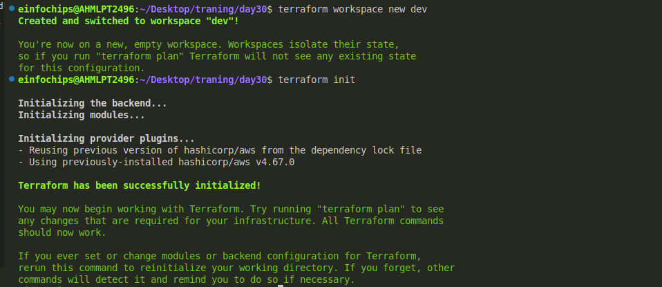
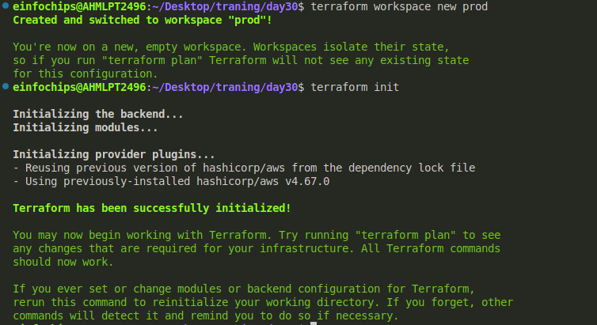

#### Project Objective:

This project is designed to evaluate participants' understanding of Terraform provisioners, modules, and workspaces. The project involves deploying a basic infrastructure on AWS using Terraform modules, executing remote commands on the provisioned resources using provisioners, and managing multiple environments using Terraform workspaces. All resources should be within the AWS Free Tier limits.

#### Project Overview:

Participants will create a Terraform configuration that deploys an EC2 instance and an S3 bucket using a custom Terraform module. The project will also require the use of Terraform provisioners to execute scripts on the EC2 instance. Finally, participants will manage separate environments (e.g., dev and prod) using Terraform workspaces.

#### Specifications:

1. Terraform Modules:
   * Create a reusable module to deploy an EC2 instance and an S3 bucket.
   * The EC2 instance should be of type t2.micro, and the S3 bucket should be configured for standard storage.
   * The module should accept input variables for the instance type, AMI ID, key pair name, and bucket name.
   * Outputs should include the EC2 instance’s public IP and S3 bucket’s ARN.
2. Terraform Provisioners:

* Use remote-exec and local-exec provisioners to perform post-deployment actions on the EC2 instance.
* The remote-exec provisioner should be used to connect to the EC2 instance via SSH and run a script that installs Apache HTTP Server.
* The local-exec provisioner should be used to output a message on the local machine indicating the deployment status, such as "EC2 instance successfully provisioned with Apache."

1. Terraform Workspaces:

* Implement Terraform workspaces to manage separate environments (e.g., dev and prod).
* Each workspace should deploy the same infrastructure (EC2 and S3) but with different configurations (e.g., different tags or bucket names).
* Ensure that the state for each workspace is managed separately to prevent conflicts between environments.

#### Key Tasks:

1. Module Development:
   * Module Setup: Create a directory for the module (e.g., modules/aws\_infrastructure).
   * Resource Definitions: Define the resources for an EC2 instance and an S3 bucket within the module.
   * Variable Inputs: Define input variables for instance type, AMI ID, key pair name, and S3 bucket name.
   * Outputs: Define outputs for the EC2 instance's public IP and the S3 bucket's ARN.
2. Main Terraform Configuration:

* Main Config Setup: In the root directory, create a Terraform configuration that calls the custom module.
* Backend Configuration: Configure Terraform to use local state storage for simplicity (optional for Free Tier compliance).

1. Provisioner Implementation:

* Remote Execution: Use the remote-exec provisioner to SSH into the EC2 instance and execute a script that installs Apache.
* Local Execution: Use the local-exec provisioner to print a confirmation message on the local machine after successful deployment.

1. Workspace Management:

* Workspace Creation: Create Terraform workspaces for dev and prod.
* Environment-Specific Configurations: Customize the EC2 instance tags and S3 bucket names for each workspace to differentiate between environments.
* Workspace Deployment: Deploy the infrastructure separately in the dev and prod workspaces.

1. Validation and Testing:

* Apache Installation Verification: After the deployment, verify that Apache is installed and running on the EC2 instance by accessing the public IP address in a web browser.
* Workspace Separation: Confirm that each workspace has its own isolated infrastructure and state files.
* Provisioner Logs: Review the output from the local-exec provisioner to ensure it indicates successful deployment.

1. Resource Cleanup:

* Destroy Resources: Use terraform destroy to remove the resources in both workspaces.
* Workspace Management: Confirm that the resources are destroyed separately in each workspace and that the state files are updated accordingly.

1. Documentation:

* Module Documentation: Provide detailed documentation of the Terraform module, including variable definitions, provisioners, and outputs.
* Workspace Documentation: Document the process for creating and managing Terraform workspaces.
* Provisioner Documentation: Include descriptions of the provisioners used and their purpose.

#### Deliverables:

* Terraform Module: The reusable module files in the modules/aws\_infrastructure directory.
* Main Terraform Configuration: The root Terraform configuration files.
* Provisioner Scripts: Any scripts used by the remote-exec provisioner for post-deployment configuration.
* Workspace Documentation: Documentation explaining the use of Terraform workspaces.
* Validation Screenshots/Logs: Screenshots or logs showing the successful execution of provisioners and Apache running on the EC2 instance.
* Cleanup Confirmation: Evidence that resources have been successfully destroyed in all workspaces.

Step 1:

Create a profile staging and production in aws using aws cli:

```
aws confugure --profile=staging
```

```
aws configure --profile=production
```

Now Create module in seperate directory here is teh directory structure:

**DAY30/modules/aws_infrastructure:**

Day30/
│
├── modules/
│   └── aws_infrastructure/
│       ├── main.tf
│       ├── variables.tf
│       ├── outputs.tf
│
├── main.tf
├── variables.tf
├── outputs.tf
├── terraform.tfvars
└── versions.tf

Now create main.tf file in DAY30/modules/aws_infrastructure directory :

```
provider "aws" {
  region = "us-east-1"  
}

resource "aws_instance" "web" {
  ami           = var.ami_id
  instance_type = var.instance_type
  key_name       = var.key_name
  tags = {
    Name = "web-instance"
  }

  provisioner "remote-exec" {
      inline = [
      "sudo apt update",
      "sudo apt install apache2 -y",
      "sudo systemctl start apache2",
      "sudo systemctl enable apache2"
    ]

    connection {
      type        = "ssh"
      user        = "ubuntu" 
      private_key = file("/home/einfochips/Desktop/traning/SPkey.pem")
      host        = self.public_ip
    }
  }

  provisioner "local-exec" {
    command = "echo 'EC2 instance successfully provisioned with Apache.'"
  }
}

resource "aws_s3_bucket" "bucket" {
  bucket = var.bucket_name
  tags = {
    Name = "my-bucket"
  }
}


```

Now create variable.tf and outputs.tf:

variable.tf

```
variable "instance_type" {
  description = "Type of the EC2 instance"
  type        = string
  default     = "t2.micro"
}

variable "ami_id" {
  description = "AMI ID for the EC2 instance"
  type        = string
}

variable "key_name" {
  description = "Name of the key pair for the EC2 instance"
  type        = string
}

variable "bucket_name" {
  description = "Name of the S3 bucket"
  type        = string
}


```

Outputs.tf:

```
output "instance_public_ip" {
  value = aws_instance.web.public_ip
}

output "bucket_arn" {
  value = aws_s3_bucket.bucket.arn
}

```

Now come to teh root directory and create main.tf, variable.tf , outputs.tf and terraform.tfvars(for the variable) file:

main.tf:

```
terraform {
  required_providers {
    aws = {
      source  = "hashicorp/aws"
      version = "~> 4.16"
    }
  }

  required_version = ">= 1.2.0"
  
backend "local" {
    path = "terraform.tfstate"
  }
}


provider "aws" {
  region = "us-east-1"  
}

module "aws_infrastructure" {
  source        = "./modules/aws_infrastructure"
  instance_type = "t2.micro"
  ami_id         = var.ami_id
  key_name       = var.key_name
  bucket_name    = var.bucket_name
  
}

```

variable.tf:

```
variable "ami_id" {
  description = "AMI ID for the EC2 instance"
  type        = string
}

variable "key_name" {
  description = "Name of the key pair for the EC2 instance"
  type        = string
}

variable "bucket_name" {
  description = "Name of the S3 bucket"
  type        = string
}

variable "key_path" {
  description = "Path to the private key file for SSH"
  type        = string
}

```

outputs.tf:

```
output "instance_public_ip" {
  value = module.aws_infrastructure.instance_public_ip
}

output "bucket_arn" {
  value = module.aws_infrastructure.bucket_arn
}

```

Now apply terraform init:

```
terraform init
```

terraform init initialize the directory and plugins related to configurations:

```
terraform plan
```


```
tarraform apply
```


Note for default you don'nt need to define default workspace by default it will fetch the default workspace.

Now we have to make terraform workspace linke:

```
terraform workspace new dev
terraform workspace new prod
```

Now to listout the workspace:

```
terraform workspace list
```

Now apply all changes in dev and prod workspace:
Firstly we have to select terraform workspace

```
terraform workspace select dev
```

```
terraform init
```



```
terraform plan
```


```
terraform apply
```


Now change the workspace to prod:

```
terraform workspace select prod
```

```
terraform init
```



```
terraform plan
```


```
terraform apply
```


here is the output of every workspace:


go to the colsole and see thge your bucket is create


Here three buckets are created I have delete the two buckets like

my-s3-bucket-eic-1 ---> default workspace

my-s3-bucket-eic-1-dev ---> dev workspace

my-s3-bucket-eic-1-prod --> prod workspace
