## Project Overview

This project involves deploying a basic 3-tier web application architecture using Terraform. The architecture includes the following components:

1. **VPC**: Virtual Private Cloud (VPC) with public and private subnets across two availability zones.
2. **Security Groups**: Security groups to manage inbound and outbound traffic for the application and database tiers.
3. **EC2 Instances**: EC2 instances in public subnets for the web servers (Application Tier).
4. **RDS Instance**: RDS MySQL instance in the private subnet for the database (Database Tier).
5. **S3 Bucket**: S3 bucket for storing static files with versioning enabled.
6. **Elastic IPs**: Elastic IPs assigned to the EC2 instances.
7. **IAM Role**: IAM role with necessary permissions attached to the EC2 instances.

## Project Steps

### Step 1: Setup Remote State and Locking

1. Create an S3 bucket for storing Terraform state.
   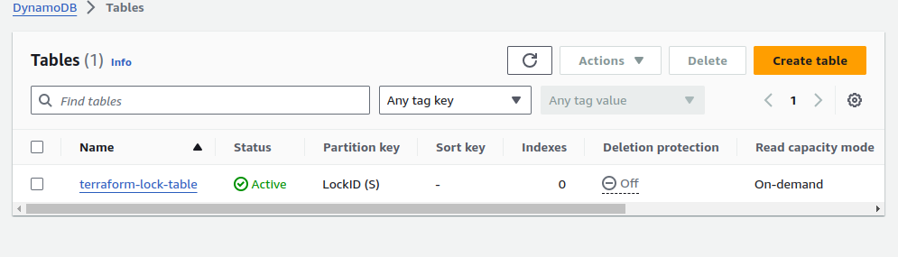
   Create a Dynamodb for state locking:

   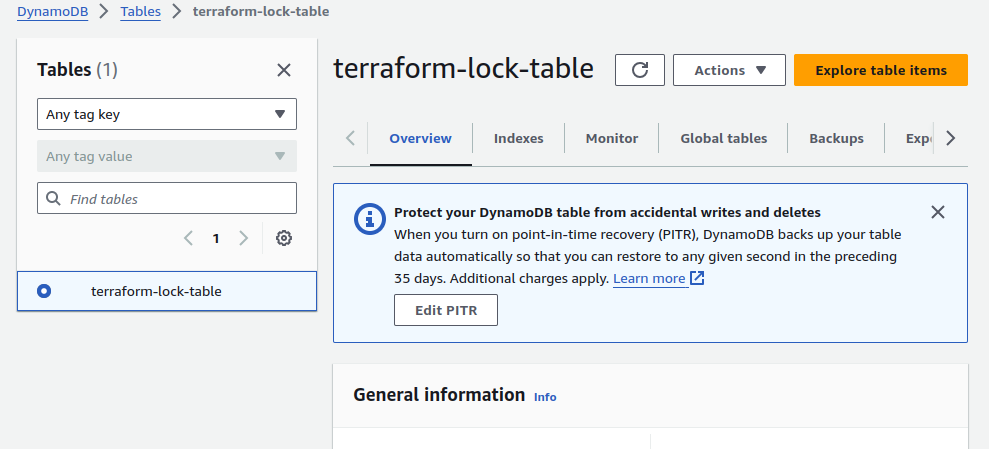

   Create teh backend in terraform to use s3 bucket and Dynamodb table

   backend.tf

   ```
   terraform {
     backend "s3" {
       bucket         = "s3-bucket-manan-001"
       key            = "terraform/state.tfstate"
       region         = "us-west-2"
       encrypt        = true
       dynamodb_table = "terraform-lock-table"
     }
   }
   ```

### Step 2: Develop and Organize Modules

1. Develop modules for VPC, EC2, RDS, S3, and IAM.
2. Place each module in a separate directory with `main.tf`, `variables.tf`, and `outputs.tf`.
3. here is te directory structure:
   ├── backend.tf
   ├── files
   │   ├── main.tf
   │   ├── outputs.tf
   │   ├── terraform.tfstate
   │   └── variables.tf
   ├── main.tf
   ├── modules
   │   ├── ec2
   │   │   ├── main.tf
   │   │   ├── outputs.tf
   │   │   └── variables.tf
   │   ├── iam
   │   │   ├── main.tf
   │   │   └── variables.tf
   │   ├── rds
   │   │   ├── main.tf
   │   │   ├── outputs.tf
   │   │   └── variables.tf
   │   ├── s3
   │   │   ├── main.tf
   │   │   └── variables.tf
   │   └── vpc
   │       ├── main.tf
   │       ├── outputs.tf
   │       └── variables.tf
   ├── outputs.tf
   ├── Readme.md
   ├── terraform.tfvars
   └── variables.tf

### Step 3: Define Variables and `.tfvars` Files

1. Define variables in `variables.tf` files within each module.
2. Create a `terraform.tfvars` file with default value

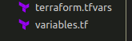

### Step 4: Implement Workspaces

1. Initialize Terraform and create workspaces (development, staging, production).

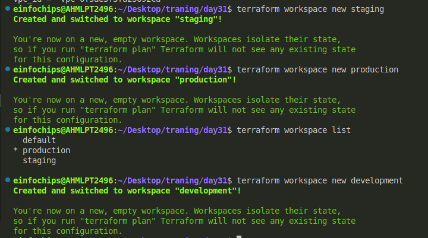

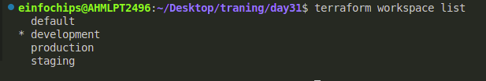

Deploy infrastructure in each workspace using the appropriate `.tfvars` file.

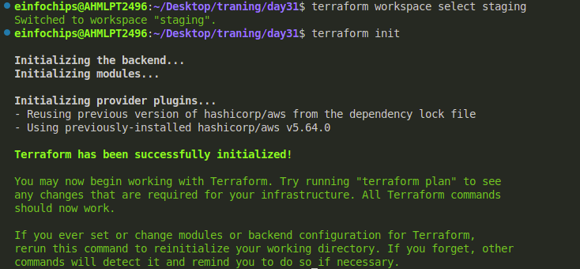

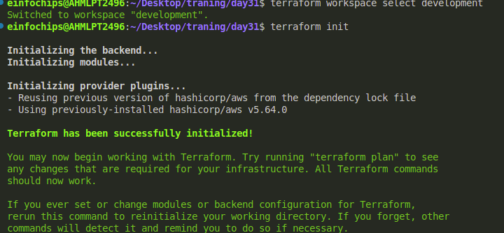

### Step 5: Deploy the Infrastructure

1. Use the `terraform apply` command to deploy the infrastructure in each workspace.
   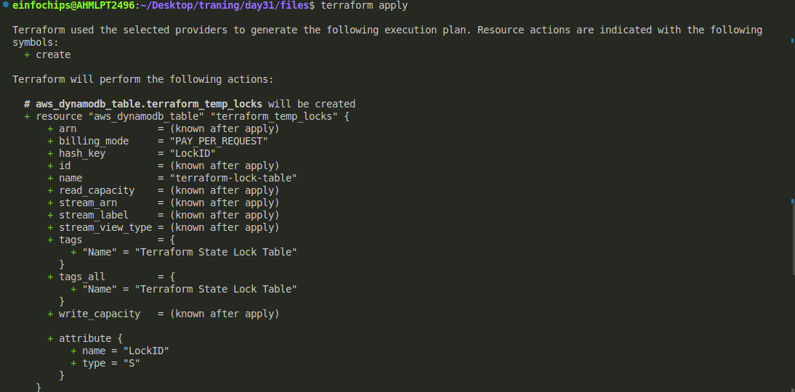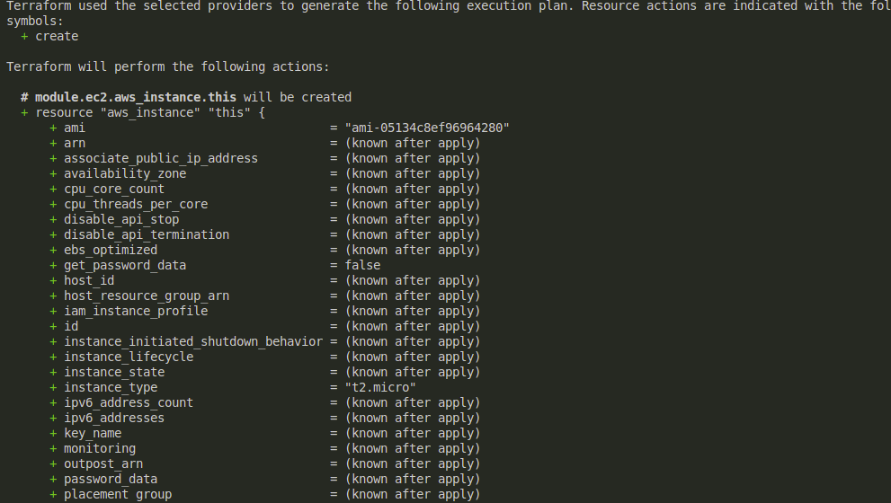

Verify the deployment by accessing EC2 instances and ensuring the application is running.

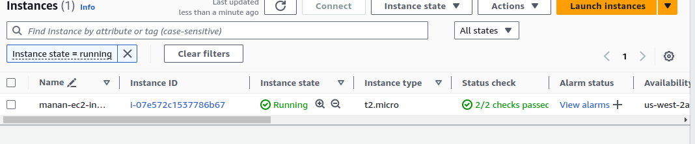

### Step 6: Implement Lifecycle Rules

1. Modify Terraform code to add lifecycle rules for critical resources.

   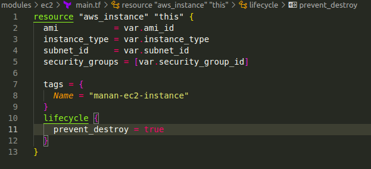

### Step 7: Cleanup

1. Destroy the infrastructure in each workspace using `terraform destroy`.

   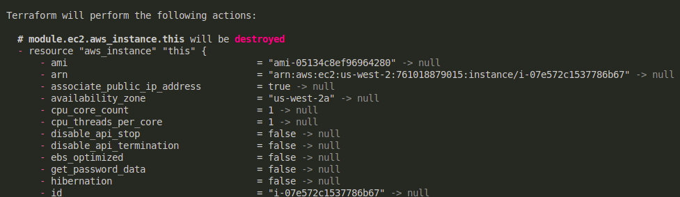

   ### Resources

   Instances:

   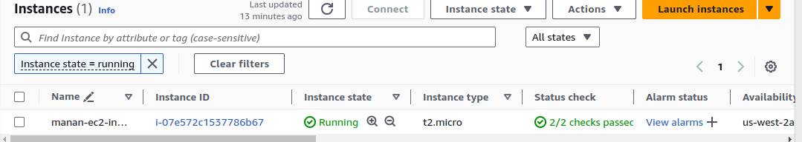

   Similarly vpc, rds is created as well as iam role subnets, internet gateways, route tables, Security groups,  s3 buckets.

   s3 buckets:
   

   Dynamodb table:
   
