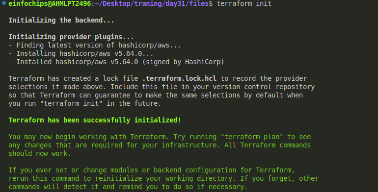
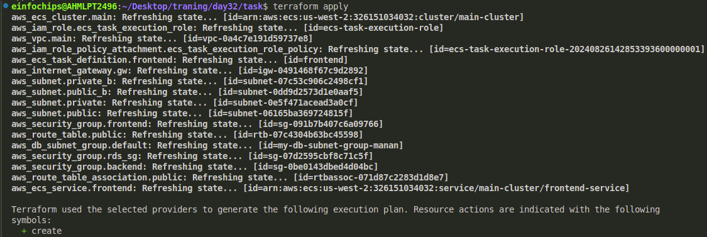
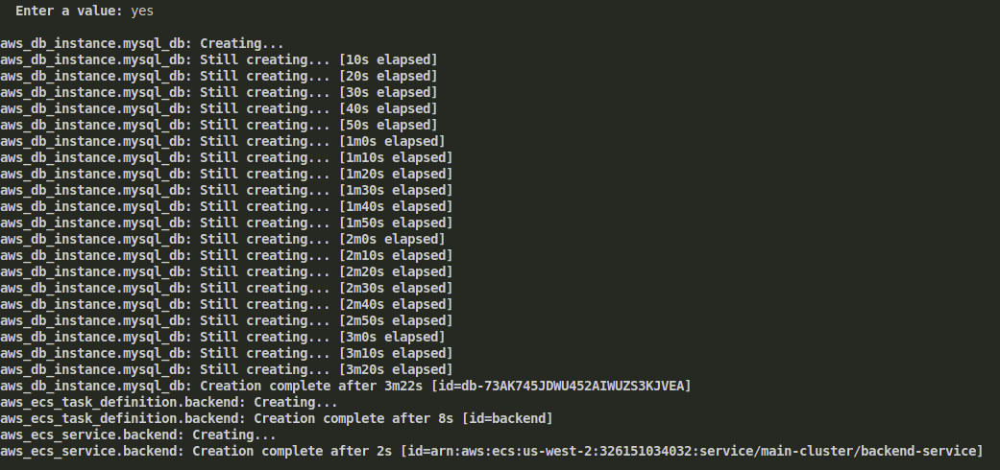
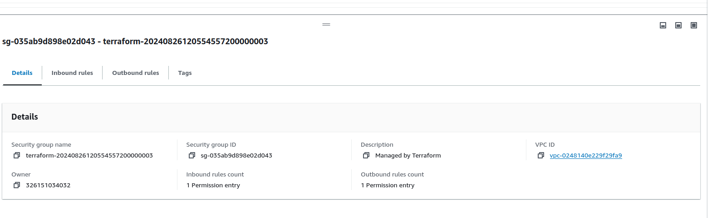

### Project Objectives:

* Set up an ECS Cluster using the Fargate launch type.
* Deploy a web application consisting of multiple containers (frontend and backend).
* Implement direct communication between frontend and backend services.
* Manage ECS tasks, services, and scaling policies.
* Ensure network security with VPC, subnets, security groups, and IAM roles.

### Project Requirements:

* ECS Cluster: Create an ECS Cluster using Fargate.
* Task Definitions: Define task definitions for web and backend services.
* Services: Create ECS services for each tier (frontend and backend) without using a Load Balancer or API Gateway.
* Security Groups: Configure security groups to allow traffic between services directly.
* IAM Roles: Create and assign IAM roles for ECS tasks.
* VPC and Networking: Create a VPC with public and private subnets, ensuring proper routing of traffic without a NAT gateway.
* Secrets Management: Use AWS Secrets Manager or SSM Parameter Store to manage database credentials.
* Scaling: Implement auto-scaling policies for the ECS services.

### Project Deliverables:

#### 1. ECS Cluster Setup

* Create an ECS cluster using the Fargate launch type.
* Ensure the cluster is running in a VPC with public and private subnets.

#### 2. Task Definitions

* Create task definitions for two services:
  * Frontend Service: A container running an NGINX server serving static content.
  * Backend Service: A container running a Python Flask API connected to an RDS instance.
* Define CPU and memory requirements for each container.
* Configure environment variables and secrets for connecting to the database.

#### 3. RDS Instance Setup

* Launch an RDS instance using the free tier template with MySQL.
* Ensure the RDS instance is in a private subnet, accessible only by the backend service.
* Store database credentials in AWS Secrets Manager or SSM Parameter Store.

#### 4. ECS Services Setup

* Deploy the frontend and backend services using ECS.
* Ensure that the frontend service can communicate directly with the backend service using the backend service's private IP or DNS name.

#### 5. Networking and Security

* Set up VPC with public subnets for the frontend service and private subnets for the backend service and RDS.
* Create security groups to:
  * Allow the frontend service to communicate with the backend service.
  * Allow the backend service to connect to the RDS instance.
  * Ensure that the frontend service is accessible from the internet while restricting access to the backend service.
* Create IAM roles and policies for ECS tasks to allow access to S3, Secrets Manager, and other required services.

#### 6. Scaling and Monitoring

* Implement auto-scaling policies based on CPU and memory usage for both services.
* Set up CloudWatch alarms to monitor service performance and trigger scaling events.

#### 7. Deployment and Validation

* Deploy the multi-tier web application using the ECS services.
* Validate the communication between the frontend and backend services.
* Test the application to ensure it functions as expected.
* Monitor the application’s performance using CloudWatch and other AWS monitoring tools.

#### 8. Resource Cleanup

* Once the deployment is validated, ensure that all AWS resources are properly terminated:
  * Stop and delete ECS tasks and services.
  * Delete the ECS cluster.
  * Terminate the RDS instance.
  * Clean up any associated S3 buckets, IAM roles, and security groups.

Now to achive this task we have to make modules for the seperate resources or just write in one file and all the resources are present in one file.

here is the main.tf file:

```
provider "aws" {
  region = "us-west-2"  
}
resource "aws_vpc" "main" {
  cidr_block = "10.0.0.0/16"
  enable_dns_support = true
  enable_dns_hostnames = true
  tags = {
    Name = "main-vpc"
  }
}

resource "aws_subnet" "public" {
  vpc_id     = aws_vpc.main.id
  cidr_block = "10.0.1.0/24"
  map_public_ip_on_launch = true
  availability_zone = "us-west-2a"  
  tags = {
    Name = "public-subnet"
  }
}
resource "aws_subnet" "public_b" {
  vpc_id     = aws_vpc.main.id
  cidr_block = "10.0.2.0/24"
  map_public_ip_on_launch = true
  availability_zone = "us-west-2b"  
  tags = {
    Name = "public-subnet_b"
  }
}

# Private Subnet
resource "aws_subnet" "private" {
  vpc_id     = aws_vpc.main.id
  cidr_block = "10.0.3.0/24"
  availability_zone = "us-west-2a"  # Change as needed
  tags = {
    Name = "private-subnet_a"
  }
}
resource "aws_subnet" "private_b" {
  vpc_id     = aws_vpc.main.id
  cidr_block = "10.0.4.0/24"
  availability_zone = "us-west-2b"  # Change as needed
  tags = {
    Name = "private-subnet_b"
  }
}
# Internet Gateway
resource "aws_internet_gateway" "gw" {
  vpc_id = aws_vpc.main.id
  tags = {
    Name = "internet-gateway"
  }
}

# Route Table
resource "aws_route_table" "public" {
  vpc_id = aws_vpc.main.id

  route {
    cidr_block = "0.0.0.0/0"
    gateway_id = aws_internet_gateway.gw.id
  }

  tags = {
    Name = "public-route-table"
  }
}

# Route Table Association
resource "aws_route_table_association" "public" {
  subnet_id      = aws_subnet.public.id
  route_table_id = aws_route_table.public.id
}

# ECS Cluster
resource "aws_ecs_cluster" "main" {
  name = "main-cluster"
}

# IAM Role for ECS Tasks
resource "aws_iam_role" "ecs_task_execution_role" {
  name = "ecs-task-execution-role"
  assume_role_policy = jsonencode({
    Version = "2012-10-17",
    Statement = [
      {
        Effect = "Allow",
        Principal = {
          Service = "ecs-tasks.amazonaws.com"
        },
        Action = "sts:AssumeRole"
      },
    ]
  })
}

resource "aws_iam_role_policy_attachment" "ecs_task_execution_role_policy" {
  policy_arn = "arn:aws:iam::aws:policy/service-role/AmazonECSTaskExecutionRolePolicy"
  role     = aws_iam_role.ecs_task_execution_role.name
}

# Security Groups
resource "aws_security_group" "frontend" {
  vpc_id = aws_vpc.main.id
  egress {
    from_port   = 0
    to_port     = 0
    protocol    = "tcp"
    cidr_blocks = ["0.0.0.0/0"]
  }
   ingress {
    from_port   = 22
    to_port     = 22
    protocol    = "tcp"
    cidr_blocks = ["0.0.0.0/0"]
  }
  ingress {
    from_port   = 80
    to_port     = 80
    protocol    = "tcp"
    cidr_blocks = ["0.0.0.0/0"]
  }
  tags = {
    Name = "frontend-sg"
  }
}

resource "aws_security_group" "backend" {
  vpc_id = aws_vpc.main.id
  egress {
    from_port   = 0
    to_port     = 0
    protocol    = "tcp"
    cidr_blocks = ["0.0.0.0/0"]
  }
  ingress {
    from_port   = 5000
    to_port     = 5000
    protocol    = "tcp"
    security_groups = [aws_security_group.frontend.id]
  }
  tags = {
    Name = "backend-sg"
  }
}

# RDS Instance
resource "aws_db_instance" "mysql_db" {
  allocated_storage    = 20
  storage_type         = var.storage_type
  engine               = var.engine
  engine_version       = var.engine_version
  instance_class       = var.instance_class
  db_name              = var.db_name
  username             = var.db_username
  password             = var.db_password
  publicly_accessible  = true
  db_subnet_group_name = aws_db_subnet_group.default.name
  vpc_security_group_ids = [aws_security_group.rds_sg.id]
}

resource "aws_secretsmanager_secret" "yashm_db_secret" {
  name = "manan_db_secret"
}

resource "aws_secretsmanager_secret_version" "manan_db_secret_version" {
  secret_id     = aws_secretsmanager_secret.manan_db_secret.id
  secret_string = jsonencode({
    password = var.db_password
  })
}

resource "aws_security_group" "rds_sg" {
  vpc_id = aws_vpc.main.id

  egress {
    from_port   = 0
    to_port     = 0
    protocol    = "tcp"
    cidr_blocks = ["0.0.0.0/0"]
  }

  ingress {
    from_port   = 3306
    to_port     = 3306
    protocol    = "tcp"
    security_groups = [aws_security_group.frontend.id]
  }
}

resource "aws_db_subnet_group" "default" {
  name       = "my-db-subnet-group-manan"
  subnet_ids = [aws_subnet.private.id, aws_subnet.private_b.id]
  tags = {
    Name = "manan-my-db-subnet-group"
  }
}

# ECS Task Definitions
resource "aws_ecs_task_definition" "frontend" {
  family                   = "frontend"
  requires_compatibilities = ["FARGATE"]
  network_mode             = "awsvpc"
  cpu                      = "256"
  memory                   = "512"

  container_definitions = jsonencode([
    {
      name      = "frontend"
      image     = "nginx:latest"
      cpu       = 256
      memory    = 512
      essential = true
      portMappings = [
        {
          containerPort = 80
          hostPort      = 80
          protocol      = "tcp"
        }
      ]
    }
  ])

  execution_role_arn = aws_iam_role.ecs_task_execution_role.arn
}

resource "aws_ecs_task_definition" "backend" {
  family                   = "backend"
  requires_compatibilities = ["FARGATE"]
  network_mode             = "awsvpc"
  cpu                      = "256"
  memory                   = "512"

  container_definitions = jsonencode([
    {
      name      = "backend"
      image     = "mtaori/flask-app:v2"
      cpu       = 256
      memory    = 512
      essential = true
      portMappings = [
        {
          containerPort = 5000
          hostPort      = 5000
          protocol      = "tcp"
        }
      ]
      environment = [
        {
          name  = "DB_HOST"
          value = aws_db_instance.mysql_db.address
        },
        {
          name  = "DB_NAME"
          value = "mydatabase"
        }
      ]
    }
  ])

  execution_role_arn = aws_iam_role.ecs_task_execution_role.arn
}

# ECS Services
resource "aws_ecs_service" "frontend" {
  name            = "frontend-service"
  cluster         = aws_ecs_cluster.main.id
  task_definition = aws_ecs_task_definition.frontend.arn
  desired_count   = 1
  launch_type     = "FARGATE"
  network_configuration {
    subnets          = [aws_subnet.public.id]
    security_groups  = [aws_security_group.frontend.id]
    assign_public_ip = true
  }

  depends_on = [
    aws_ecs_task_definition.frontend
  ]
}

resource "aws_ecs_service" "backend" {
  name            = "backend-service"
  cluster         = aws_ecs_cluster.main.id
  task_definition = aws_ecs_task_definition.backend.arn
  desired_count   = 1
  launch_type     = "FARGATE"
  network_configuration {
    subnets          = [aws_subnet.private.id]
    security_groups  = [aws_security_group.backend.id]
    assign_public_ip = false
  }

  depends_on = [
    aws_ecs_task_definition.backend
  ]
}
# resource "aws_appautoscaling_target" "frontend" {
#   service_namespace = "ecs"
#   resource_id =  "service/${aws_ecs_cluster.main.name}/${aws_ecs_service.frontend.name}"
#   scalable_dimension = "ecs:service:DesiredCount"
#   min_capacity      = 1
#   max_capacity      = 3
# }
# resource "aws_autoscaling_policy" "frontend_scale_out" {
#   name                   = "foobar3-terraform-test"
#   scaling_adjustment     = 1
#   adjustment_type        = "ChangeInCapacity"
#   cooldown               = 60
#   autoscaling_group_name = aws_autoscaling_group.bar.name


# }
resource "aws_appautoscaling_target" "frontend_scaling_target" {
  max_capacity       = 2
  min_capacity       = 1
  resource_id        = "service/${aws_ecs_cluster.yashm_ecs_cluster.name}/${aws_ecs_service.frontend.name}"
  scalable_dimension = "ecs:service:DesiredCount"
  service_namespace  = "ecs"
}

resource "aws_appautoscaling_policy" "frontend_scale_out" {
  name               = "frontend_scale_out"
  policy_type        = "StepScaling"
  resource_id        = aws_appautoscaling_target.frontend_scaling_target.resource_id
  scalable_dimension = aws_appautoscaling_target.frontend_scaling_target.scalable_dimension
  service_namespace  = aws_appautoscaling_target.frontend_scaling_target.service_namespace

  step_scaling_policy_configuration {
    adjustment_type         = "ChangeInCapacity"
    cooldown                = 300
    metric_aggregation_type = "Maximum"

    step_adjustment {
      metric_interval_lower_bound = 0
      scaling_adjustment          = 1
    }
  }
}

resource "aws_appautoscaling_policy" "frontend_scale_in" {
  name               = "frontend_scale_in"
  policy_type        = "StepScaling"
  resource_id        = aws_appautoscaling_target.frontend_scaling_target.resource_id
  scalable_dimension = aws_appautoscaling_target.frontend_scaling_target.scalable_dimension
  service_namespace  = aws_appautoscaling_target.frontend_scaling_target.service_namespace

  step_scaling_policy_configuration {
    adjustment_type         = "ChangeInCapacity"
    cooldown                = 300
    metric_aggregation_type = "Maximum"

    step_adjustment {
      metric_interval_upper_bound = 0
      scaling_adjustment          = -1
    }
  }
}


```

Now this main.tf file contain:

VPC.

Public and private subnets accourding to region.

Resources for the internet gateway.

Routable.

Resource for the aws_ecs_cluster.

Iam role for the ecs task execution.

Security group for backend service and frontend service as wee and for the rds database.

Resource to create aws_rds_database.

Resource for the autoscaling, etc

Now terraform init to install plugins.

```
terraform init
```



Now terraform plan

```
terraform plan
```


Now terraform apply to apply the change sand to see the desired outputs.

```
terraform apply
```





now go to the console and see the configurations you  have done.

Security group attached to vpc:


