Activity to deploy the kubeadm in ec2 cluster. Ons of the instance is t2.medium and other is t2.micro where t2.medium is for Master node nad t2.micro is for slave node.

Install contained in both of the instances.

the steps are:

```
sudo apt-get update
sudo apt-get install -y apt-transport-https curl
sudo add-apt-repository "deb [arch=amd64] https://download.docker.com/linux/ubuntu $(lsb_release -cs) stable"
sudo apt update
sudo apt install -y containerd.io
sudo systemctl start containerd
sudo systemctl enable containerd
```

Here are the steps to install containerd in machine

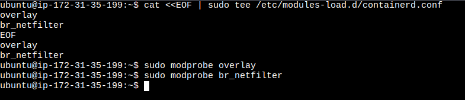

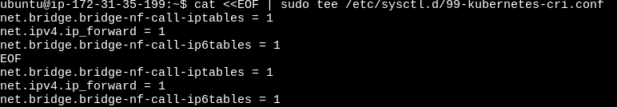

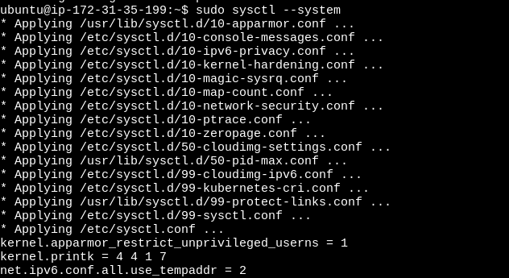

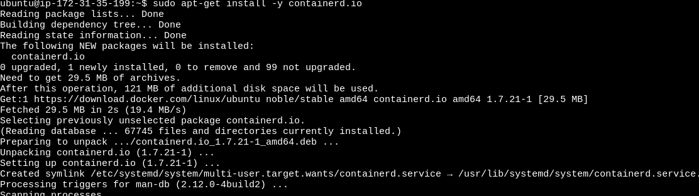

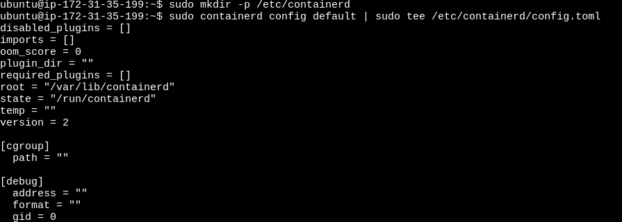

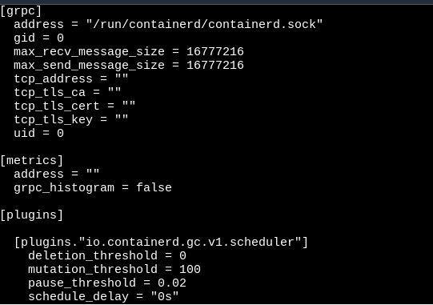

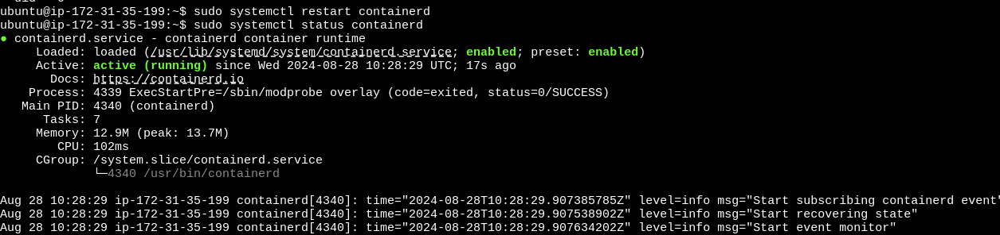

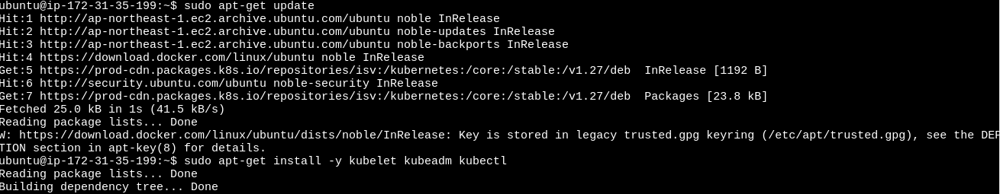

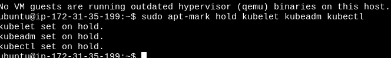

```
sudo kubeadm init --pod-network-cidr 192.168.0.0/16 --kubernetes-version 1.27.11
```

Steup kubectl access:

```
mkdir -p \$HOME/.kube
sudo cp -i /etc/kubernetes/admin.conf \$HOME/.kube/config
sudo chown \$(id -u):\$(id -g) \$HOME/.kube/config
```

This command is used to create token, this will give the token with kubeadm join command:

```
kubeadm join <ip_address> --token cebqgk.9r2y7h65a9zndvze
--discovery-token-ca-cert-hash sha256:12345
```

Now this token you have to paste in the salve node and we got this as outputs:
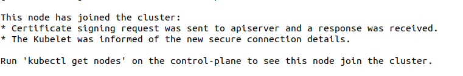

Now apply kubectl get node sin master node then we got the list of nodes that is attached to master node

Now apply all these steps in salve node as well.
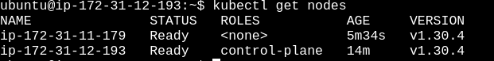

Now to install Grafana and Prometheus in kubenetes cluster.


# Deploy Prometheus and Grafana on Kubernetes using Helm Charts

This guide will walk you through deploying Prometheus and Grafana on a Kubernetes cluster using Helm charts.

## Prerequisites

* A Kubernetes cluster (Minikube, EKS, GKE, AKS, etc.)
* Helm installed on your local machine
* kubectl configured to access your Kubernetes cluster

## 1. Add Helm Repositories

First, you need to add the Helm repositories that contain the charts for Prometheus and Grafana.


```
helm repo add prometheus-community https://prometheus-community.github.io/helm-charts
helm repo add grafana https://grafana.github.io/helm-charts
```


* Update your Helm repositories to ensure you have the latest charts.

```
helm repo update
```


## 2. Install Prometheus

Create a namespace for Prometheus (optional but recommended). If you want

```
kubectl create namespace prometheus
```

```
helm install prometheus prometheus-community/prometheus
```

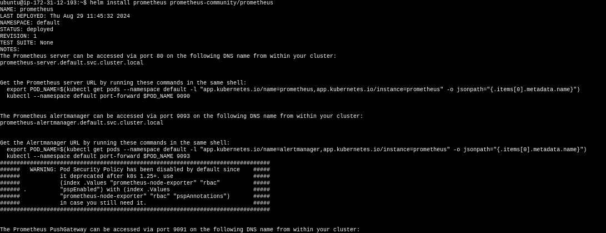


## 3. Install Grafana

Install Grafana using Helm.

Add the repo of grafana using this command and update it.

```
helm repo add grafana https://grafana.github.io/helm-charts
helm repo update
```

```
helm install grafana grafana/grafana 
```

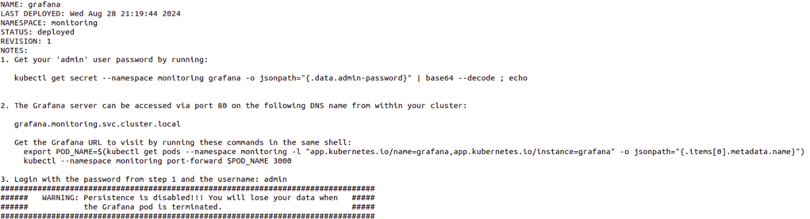


## 4. Access Grafana Dashboard

To access the Grafana dashboard, you need to set up port forwarding.

```
kubectl port-forward service/grafana 3000:80 
```

Open your browser and navigate to [http://localhost:3000].


## 5. Access Prometheus Dashboard (Optional)

You can also access the Prometheus dashboard by port-forwarding the Prometheus service.

```
kubectl port-forward service/prometheus-server 9090:80 
```

Open your browser and navigate to [http://localhost:9090](http://localhost:9090/).
