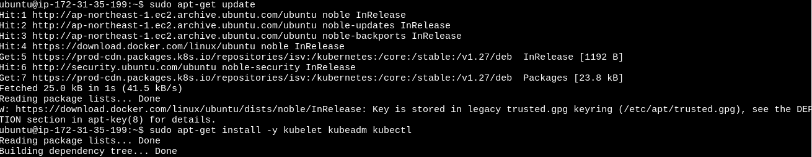

# Day 35:

### In this task, I have deployed a Kubernetes application on AWS EC2 instances and set up a monitoring stack using Prometheus and Grafana. This project is designed to test the knowledge of deploying and configuring monitoring solutions in a Kubernetes environment on AWS

### For this task, First of all, I created 3 EC2 instances. One for control plane which was t2.medium and a couple for data plane which were t2.micro.

Make the 3 instance one of them is t2.medium in Control_plane  and other two are t2.micro dat plane.





Repeat the command in all the dataplane node and we found this.


If we done in comtrol plane it shows this.

```
kubectl get nodes
```


Now install Prometheus and Grafana using helm chart.


Install Prometheus:


Go to the browser and type https://localhost:9090


### Next, I installed grafana as using helm. For that, I ran the below given commands:

```
vi grafana-values.yml

adminPassword: password


kubectl create namespace grafana
helm repo add grafana https://grafana.github.io/helm-charts
helm repo update
helm install grafana grafana/grafana -f ~/grafana-values.yml --namespace grafana
kubectl get all -n grafana

```

### To deploy a NodePort Service to Provide External Access to Grafana.

```
  helm install grafana grafana/grafana -f ~./grafana-values.yaml --namespave grafana
```


Now hit the ip and port number https://localhost:3000


